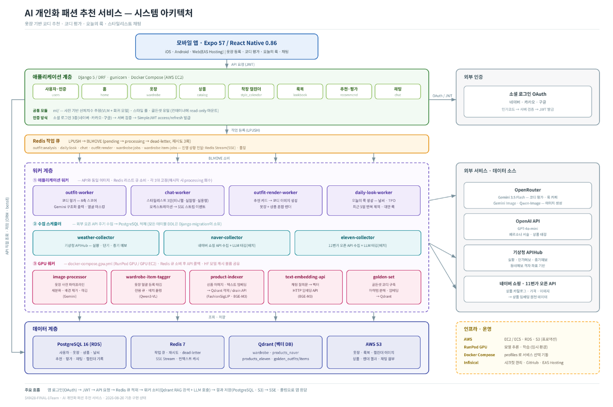
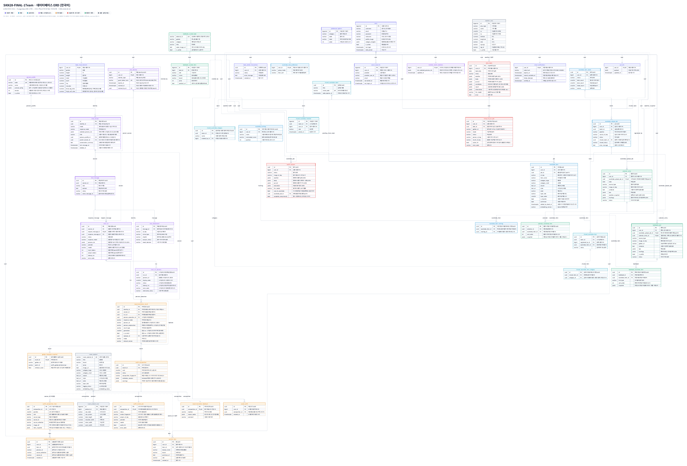

# 👗 COZY - 옷장에서 시작하는 AI 패션 추천

<p align="center">
  쇼핑몰이 팔고 싶은 옷이 아니라, <b>내 옷장에서 오늘 입을 수 있는 옷</b>을 추천합니다.
</p>

<p align="center">
  
  
  
  
  
  
</p>

## ⌨️ 프로젝트 개요

- **프로젝트명** : COZY (SK네트웍스 Family AI 캠프 28기 · 최종 프로젝트 1팀)
- **기간** : 2026.07.08 ~ 2026.08.27
- **구성원** : 6명 (모바일 · API/인프라 · 추천/채팅 · ML · 이미지 워커 · 기획)
- **내 역할** : 신체치수 추정 ML·API, 공유 옷장 풀스택, 골든셋·모델 벤치마크
- **원본 저장소** : [SKNETWORKS-FAMILY-AICAMP/SKN28-FINAL-1Team](https://github.com/SKNETWORKS-FAMILY-AICAMP/SKN28-FINAL-1Team) (이 저장소는 fork)
- **앱 빌드** : Expo EAS - [expo.dev/accounts/vosnuevo/projects/skncozyhy](https://expo.dev/accounts/vosnuevo/projects/skncozyhy)

<br/>

---

<!------- 왜 만들었나 -------->

<a name="why"></a>

## 🎯 왜 만들었나

옷은 이미 충분히 많은데 아침마다 입을 게 없다. 기존 패션 서비스는 **팔 물건**을 기준으로 추천하기 때문에, 추천을 받아도 결국 새로 사야 실행할 수 있다.

이 서비스는 출발점을 뒤집었다. **사용자가 이미 가진 옷**을 디지털로 등록하고, 그 옷장을 후보 풀로 삼아 오늘의 날씨·TPO·체형·추구미에 맞는 코디를 추천한다. 추천이 곧바로 실행 가능하고, 새 옷 추천도 "지금 옷장과 어떻게 조합되는지"를 근거로 제시하므로 충동구매 대신 활용도 높은 구매로 이어진다.

| | 기존 패션 추천 | COZY |
|---|---|---|
| 추천 대상 | 판매 재고 | **보유 옷장 + 판매 상품** |
| 실행 가능성 | 구매해야 실행 | **오늘 바로 입을 수 있음** |
| 근거 | 인기순 · 협업필터링 | **날씨 · 체형 · TPO · 조합 사례 기반 RAG 설명** |
| 개인화 축 | 구매 이력 | **옷장 · 신체치수 · 추구미 · 착장 기록** |

<br/>

<!------- 핵심 기능 -------->

<a name="features"></a>

## ⭐️ 핵심 기능

| 기능 | 입력 | 출력 | 비고 |
|---|---|---|---|
| **옷장** | 옷·전신 사진 | 분리된 아이템 + 태그 | 일괄 등록·해시태그·재색인 |
| **추구미** | 온보딩 선택·수정 | 추천 가중치 신호 | 누적 |
| **오늘의 룩** | 위치·옷장·체형·TPO | 코디 카드 | 조회가 곧 생성 트리거 |
| **스타일리스트** | 자연어·사진 | 코디 카드 (SSE) | 3인 페르소나(미니멀·실용·실험) |
| **코디 평가** | 착장 사진 | 8개 축 점수·코멘트 | 근거 없으면 축 제외·재정규화 |
| **룩북·캘린더·공유옷장** | 룩/날짜/멤버 | 저장·기록·멤버 공유 | 공유옷장은 `confirmed`만 |
| **신체치수·사이즈** | 키·몸무게·성별·(사진) | 14개 치수·비율 | 무사진→VLM 2단 구조 |

<a name="mywork"></a>

# 🙋 내가 한 일 - 전하영 ([@vosnuev](https://github.com/vosnuev))

> 팀 저장소 전 브랜치 기준 **커밋 156개(비머지 130개)**. 아래는 그중 기능 단위로 묶어 정리한 것이고,
> 각 항목은 저장소 안의 코드·문서·평가 결과로 근거를 확인할 수 있다.

| 영역 | 내가 맡은 범위 | 스택 |
|---|---|---|
| **신체치수 추정** | 데이터 구축 · 모델 학습 · VLM 후보 벤치마크 · 추정 API 2종 · 사진 품질 검증 | scikit-learn · OpenRouter VLM · Django |
| **공유 옷장** | 도메인 설계 · 방/멤버/아이템 API · 동시성 제어 · 추천 검색 연동 · 모바일 UI | Django/DRF · PostgreSQL · Qdrant · React Native |
| **추구미(pursuit)** | 옵션·조회·저장 API와 모바일 화면 연결 | Django/DRF · React Native |
| **골든셋** | 체형·색상 판단 규칙 데이터셋 구축, 추천 가중치 레이어 설계 | 데이터 · 규칙 설계 |
| **스타일리스트·옷장 채팅 기획** | 페르소나(미니멀·실용·실험) 정의 · 공유옷장 아이템 추천 후보 연동 기획·요구사항 정의 | UX 기획 · API 스펙 |
| **캘린더 · 옷장 UX** | 단일 슬롯 중복 방지, 옷장·채팅 연동 UX, 실사용 버그 수정 | Django/DRF · React Native |
| **팀 인프라** | Infisical 시크릿 온보딩 가이드, compose 환경변수 주입 방식 문서화 | Infisical · Docker Compose |
| **모바일 빌드** | Expo EAS 빌드 · 계정 산출물 관리 | Expo 57 · EAS |

<br/>

## 1️⃣ 신체치수 추정 - 줄자 없이 14개 치수

**문제** - 체형 기반 추천에 치수가 필요하나, 사용자는 줄자로 재서 입력하지 않음
**해법** - 입력을 `성별 · 키 · 몸무게` 3개로 축소, 나머지 14개는 추정
**결과** - 무사진 모델 3종 조합 + 사진(VLM) 보정의 2단 구조

| 단계 | 한 일 | 핵심 근거 |
|---|---|---|
| 모델 선정 | 알고리즘 7종 벤치마크 | KNN이 MAE 1위였으나 HGB 채택 |
| 구성 설계 | 단일 모델 → 3종 분리 | `leg_length` 편향 **−11.6cm** 발견 |
| 사진 경로 | VLM 4종 벤치마크 | Kimi K2.5 채택 (MAE 2.757) |
| 성능 검증 | 사진 vs 무사진 A/B | **집계 기준에 따라 결론 역전** |
| 신뢰성 | 재현성 대조 | `temperature=0`에도 불일치 |

---

### 1-1. 서빙 구성 - 모델 3개 + 후처리

| 출력 | 개수 | 모델 | 학습 모집단 |
|---|---:|---|---|
| `chest` `waist` `hip` `shoulder` | 4 | `hist_gradient_boosting_181` | 직접측정 172행 |
| `thigh` `calf` `arm` | 3 | `hist_gradient_boosting_circumference` | 직접측정 178행 |
| `thigh/calf/torso/leg/neck_length` | 5 | `hist_gradient_boosting_exact_lengths_v2` | 3D **4,485행** |
| `thigh_calf_ratio` `torso_leg_ratio` | 2 | 모델 없음 - 서버 후처리 나눗셈 | - |

---

### 1-2. 왜 셋으로 쪼갰나 - "오차"가 아니라 "정의"가 틀림

시작은 **모델 하나.** 181명 직접측정으로 둘레 7 + 길이 5 = 12개 타깃을 한 번에 학습. 지금 구성은 설계가 아니라 **검증에서 나온 결과**.

**① 길이 5개를 3D 정확 정답과 대조 → 붕괴**

| 항목 | 옛 MAE | 옛 **편향** | 새 MAE | 새 편향 |
|---|---:|---:|---:|---:|
| `leg_length` | **11.613** | **−11.612** | 1.537 | −0.001 |
| `torso_length` | 2.944 | −2.460 | 1.660 | −0.001 |
| `calf_length` | 2.423 | +2.226 | 1.065 | −0.004 |
| `neck_length` | 2.176 | +1.877 | 0.917 | −0.004 |
| `thigh_length` | 1.673 | −0.416 | 1.396 | −0.001 |

- 볼 것은 MAE가 아니라 **편향(bias)**
- `leg_length` - MAE 11.613 / 편향 −11.612 → 오차가 **거의 전부 한 방향**
- 무작위로 틀리면 편향은 0에 수렴 → 한 방향 쏠림 = **다른 값을 재고 있었다는 신호**

**② 원인 = 랜드마크 정의 불일치**

| 항목 | 옛 정의 | 새 정의 |
|---|---|---|
| `leg_length` | 샅높이 (바닥 기준) | 위앞엉덩뼈가시높이 − 가쪽복사높이 |
| `torso_length` | 겨드랑높이 − 엉덩이높이 | 어깨높이 − 위앞엉덩뼈가시높이 |
| `calf_length` | 무릎높이 (바닥 기준) | 무릎뼈가운데높이 − 가쪽복사높이 |
| `thigh_length` | 샅높이 − 무릎높이 | 샅높이 − 무릎뼈가운데높이 |
| `neck_length` | 목뒤높이 − 겨드랑높이 | 턱끝높이 − 목앞높이 |

- "바닥→샅 높이"와 "골반점→복사뼈 길이"는 **처음부터 다른 양**
- 그 차이가 −11.6cm로 그대로 노출
- **모델 튜닝으로는 절대 못 잡는 종류의 오류**

**③ 길이만 분리해 3D 데이터로 재학습**

- 원천 4,545행 → 결측·무한 57 / 무효 3 제외 → **4,485행** (여 2,510 / 남 1,975)
- `MultiOutputRegressor(HistGradientBoostingRegressor)` · seed 42 · shuffled 5-fold CV
- 아티팩트에 **sha256 기록** → 서빙 중인 파일 추적 가능
- 결과: 편향 **−0.001 수준**. 정의를 맞추자 남은 건 순수 예측 오차뿐

**④ 181 모델은 폐기 대신 "출력 일부만 서빙"으로 격리**

```json
// manifest_181.json
"serving_status":     "core_measurements_only",
"serving_targets":    ["chest", "waist", "hip", "shoulder"],
"length_replacement": "hist_gradient_boosting_exact_lengths_v2.joblib",
"note": "3D 기준값과 숫자가 호환되지 않는다. 골든셋 임계값을 이 분포로 재산출해야 한다."
```

- `targets`에는 12개가 남아 있으나 **실제 서빙은 4개뿐**
- 파일에 명시하지 않으면 → 나중에 `metrics_181.json`의 길이 지표가 현재 성능으로 오인용됨

**⑤ 부가 둘레 3개를 또 분리한 근거**

| 항목 | 181 모델 (MAE / R²) | **부가 둘레 모델 - 서빙** |
|---|---:|---:|
| `thigh` | 2.379 / 0.569 | **2.223 / 0.645** |
| `calf` | 1.294 / 0.562 | **1.183 / 0.619** |
| `arm` | 1.247 / 0.737 | **1.170 / 0.775** |

- 세 항목 **전부** 별도 모델이 우수 → 별도 모델 값을 서빙
- 181 모델의 동명 출력은 **인용 금지**로 문서화 (같은 컬럼명 두 값이 공존 → 규칙 없으면 반드시 섞임)

> ⚠️ **남은 부채** - 부가 둘레 모델만 `scripts/`에 학습 스크립트 부재. 아티팩트·지표·행별 예측(178행)은 일치하나 **재학습 경로 단절**. 숨기지 않고 평가 문서에 명시.

**⑥ 비율 2개는 모델 없이 후처리**

- **일관성** - 비율을 따로 예측하면 응답 안의 길이 값과 비율이 불일치. 한 화면에 둘 다 노출되므로 계산이 어긋나면 즉시 신뢰 손실
- **예측 불가** - `torso_leg_ratio`는 R² **0.020**, 사실상 집단 평균. 모델을 만들어도 상수에 가까운 값

> **배운 것** - MAE 하나만 봤다면 `leg_length` 정의 오류는 끝까지 미발견. **편향을 따로 본 것 + 정답 데이터를 바꿔가며 대조한 것**이 결정적.

---

### 1-3. 왜 HistGradientBoosting인가 - KNN이 MAE 1위였는데도

**같은 시험지, 7종 비교.** SizeKorea 정제 5,092행 → 학습 4,092 / 공통 test **1,000명** (`random_state=42`, `test_set.csv` 고정). 입력 3개, 출력 치수 7개. HF 3종도 Colab GPU에서 **같은 `test_set.csv`** 사용 → 분할 동일.

| 순위 | 모델 | MAE (cm) | RMSE | R² | 1건 예측 |
|---:|---|---:|---:|---:|---:|
| 1 | `knn` | **1.915** | 2.465 | 0.785 | **0.013 ms** |
| 2 | **`hist_gradient_boosting`** ← 채택 | 1.920 | **2.461** | **0.786** | 0.170 ms |
| 3 | `random_forest` | 1.929 | 2.469 | 0.785 | 0.104 ms |
| 4 | `tabpfn_v2` (HF) | 1.971 | 2.515 | 0.775 | 9.85 ms |
| 5 | `nori` (HF) | 1.980 | 2.528 | 0.773 | 19.89 ms |
| 6 | `tabpfn_mix` (HF) | 2.008 | 2.561 | 0.768 | 3.47 ms |
| 7 | `baseline` (평균 반환) | 4.497 | 5.593 | −0.001 | 0.0001 ms |

**판단 5가지**

| # | 판단 | 근거 |
|---:|---|---|
| 1 | MAE 차 **0.005cm는 무의미**, RMSE 차는 유의미 | 줄자 눈금(0.1cm)보다 작음 / HGB가 RMSE·R² 1위 = **큰 실수가 적음** |
| 2 | KNN이 잘 맞은 이유 자체가 위험 신호 | 학습 분포 내에서만 강함. 이웃 평균이라 **범위 밖 값 생성 불가** |
| 3 | HF 3종 전부 기각 | 정확도 우위 없이 **265 ~ 1,500배 지연** + GPU·외부 의존성. `tabpfn_mix`는 학습만 261초 |
| 4 | `baseline`을 반드시 동반 | R² −0.001 → 나머지 6종이 **실제로 학습 중**임을 증명. 4.50 → 1.92cm |
| 5 | 여기서 **모델 교체 중단** | 6종이 1.915 ~ 2.008cm로 수렴(폭 0.09cm) = 모델 한계 아닌 **입력 3개의 한계** → 사진 경로로 전환 |

> ⚠️ **인용 주의** - 이 벤치마크는 정제 5,092행 · 치수 7개 기준. 현재 서빙(§1-1)은 이후 **직접측정 181명 / 3D 4,485행으로 데이터셋을 다시 잡고 14개 계약으로 변경**한 것. 두 MAE를 섞어 인용 불가. **모델 선정 근거로만 사용.**

---

### 1-4. 사진 경로 - 가장 안 맞는 부위가 가장 중요한 부위

- 무사진 모델 최대 오차 = **허리 3.406 · 가슴 3.043**
- 그런데 이 두 부위가 **상·하의 사이즈를 결정**
- 평균은 준수한데 **정작 쓸모 있는 부위에서 틀리는** 구조 → 정면·측면 전신 사진 보정 경로 추가

**VLM 후보 4종 벤치마크** (validation 39명 · 동일 프롬프트·입력)

| 모델 | 평균 MAE (cm) | 평균 시간 | 호출당 비용 |
|---|---:|---:|---:|
| **Kimi K2.5** ← 채택 | **2.757** | 7.653 s | $0.004492 |
| Grok 4.3 | 3.441 | 1.747 s | $0.005977 |
| Qwen 3.7 Flash | 3.597 | 5.106 s | $0.000152 |
| Gemini 3.5 Flash-Lite | 3.962 | 5.985 s | 미기록 |

- 정확도 1위 Kimi 채택
- 단, **Qwen은 0.84cm 열세 대신 약 30배 저렴** → 규모 확대 시 전환이 합리적임을 함께 기록
- 목적: 나중 사람이 **재실험 없이** 그 판단을 내릴 수 있게 하기 위함

---

### 1-5. A/B 검증 - 집계 기준에 따라 결론 역전

테스트 143명 · 부위별 MAE(cm)

| 집계 기준 | 무사진 | 사진 | 승자 |
|---|---:|---:|---|
| 3개 (가슴 · 허리 · 엉덩이) | 3.616 | **3.126** | 사진 |
| 7개 전체 | **2.474** | 2.822 | 무사진 |

- 사진 우세: **가슴 −1.222 · 허리 −0.930** 2개 부위뿐
- 무사진 우세: 나머지 5개 (특히 **어깨는 사진이 2.17cm 열세**)
- 즉 **"사진이 더 정확하다"는 문장은 집계 기준을 밝히지 않으면 거짓**
- → 성능 인용 시 3개/7개 기준 병기를 **문서 규칙으로 제정**

---

### 1-6. 상용 VLM 재현성 - `temperature=0`으로도 불일치

| 대상 | 다른 날 재호출 시 일치 부위 |
|---|---|
| `sizkorea_f111` | **0 / 7** |
| `sizkorea_m095` | **2 / 7** |

- 원인 - 상용 API의 내부 배치·라우팅
- 규칙 - **단건 결과로 성능 판단 금지**, 벤치마크는 응답을 CSV로 남겨 대조

---

### 1-7. 그 외 구현

| 항목 | 내용 |
|---|---|
| API | `POST /users/me/body/estimate/` (무사진) · `POST /users/me/body/photos/` (사진, 202 + 폴링) |
| 사진 검증 | 다인 검출 · 프레이밍 · 화질 미달 시 저장 차단 + fallback 라벨링 |
| 실패 처리 | `error_code` / `error_message` 저장 · 사용자당 진행 1건 제약 · 10분 초과 자동 만료 |
| 개인정보 | **사진 미저장** - 요청에서 바이트로 읽어 추론에만 사용 후 폐기 |
| 2단 구조 | 기본 모델로 14개 선채움 → VLM 결과로 덮어쓰기. VLM 누락 부위가 있어도 **응답에 빈칸 없음** |

> **기여 경계** - 신체치수 **입력** API와 사진 업로드 비동기 구조는 팀원이 선행 구축, 그 시점엔 추정 자리에 고정값 저장.
> 내 작업은 **그 위의 추정 로직 전체**(`body_inference.py` +321 / −71줄, 최종 338줄)와 ML 파이프라인(`ml/body_measurement/`).
> "신체치수 추정 기능을 만들었다" ✅ / "처음부터 끝까지 혼자 만들었다" ❌

<br/>

## 2️⃣ 공유 옷장 - 설계부터 추천 연동, 모바일 화면까지

옷장은 원래 1인 소유 모델이었다. 여기에 **최대 6명이 한 방에서 옷을 공유하고, 다른 멤버의 옷도 추천 후보에 들어가는** 구조를 얹었다. 도메인 설계 · 백엔드 API · 추천 검색 연동 · 모바일 UI를 나눠 맡지 않고 한 사람이 관통했다.

**백엔드**

- 공유방 · 멤버 · 아이템 API, **24시간 초대 코드**, 방장 위임, 탈퇴/삭제 정책
- 공유 예약을 기기 local state에서 **DB 예약 구조로 이전** - 아이템 업로드 job이 확정될 때까지 예약이 유지된다
- 한 옷을 **여러 방에 동시에** 공유 가능하도록 개선
- 방 참여 시 `select_for_update` 행 잠금으로 동시 입장 경합 방어 (정원 초과·중복 참여 차단)
- UUID 형식 오류 · 방 이름 길이 · 권한 관련 4xx 처리 보강, 단위 테스트 추가

**추천 연동**

- 내 옷 + 참여 중인 방의 옷을 합쳐 **접근 가능한 아이템 ID를 DB에서 계산**하고, 이를 Qdrant `HasIdCondition` 화이트리스트로 넘긴다
- ID 목록이 무한정 커지지 않도록 `RETRIEVER_WARDROBE_ID_CAP` 설정 추가
- 공유 옷장 아이템이 채팅 추천 후보로 들어가도록 리트리버까지 연결, retriever 테스트 추가

**모바일 (React Native)**

- 공유 옷장 온보딩 · 초대 미리보기 · 참여 flow를 백엔드 API와 연결
- 아이템 등록/상세 화면의 다중 방 선택 UI (4×2 그리드), PC 웹 2행 · 모바일 한 줄 반응형 분기
- 멤버 파스텔 색상 자동 배정, 소유자 배지, 공유 카드 인라인 해제
- 채팅 입력바에 옷장 아이템 선택 시트 연결, **옷장 카드를 채팅 드롭존으로 드래그**하는 UX 구현

> 화면과 API를 나눠 맡지 않았기 때문에, 요청·응답 계약이 어긋나는 지점을 화면에서 바로 확인하고 고칠 수 있었다.

<br/>

## 3️⃣ 골든셋 - "좋은 코디 모음"이 아니라 "점수의 근거"로

골든셋 체형·색상 판단 규칙 데이터셋을 구축하고, 이를 추천 파이프라인의 **가중치 레이어**로 연결했다.

핵심 판단은 **골든셋을 정답으로 쓰지 않은 것**이다. 골든셋을 그대로 정답처럼 쓰면 수집한 사람의 취향이 사용자에게 강요된다. 그래서 우선순위를 이렇게 뒀다.

| 순위 | 신호 | 처리 |
|---|---|---|
| 1 | 사용자가 **싫다고 한** 조건 | 강한 감점 - 골든셋보다 우선 |
| 2 | 사용자 선호 · 추구미 | 가점 |
| 3 | 골든셋 체형·색상 규칙 | 랭킹 **앞단의 보정 가중치** |

<br/>

## 4️⃣ 그 외 기여

- **추구미(pursuit)** - 옵션·조회·저장 API 구현과 모바일 화면 연결. 사용자가 긴 설명을 쓰지 않아도 추천 조건이 쌓이게 하는 장치다.
- **착장 캘린더** - 하의·신발·원피스/세트·모자 등 단일 슬롯 카테고리 중복 방지. 수동 등록과 AI 룩북 자동 등록 **두 경로 모두**에 검증을 적용하고 `DuplicateCategorySlotError` / 400 응답과 단위 테스트를 추가했다.
- **팀 인프라** - Infisical 시크릿 온보딩 가이드([`docs/infisical-guide.md`](docs/infisical-guide.md)) 작성. compose가 값을 찾는 두 경로(`env_file` vs `${VAR}` 보간)를 문서화해, 팀에서 반복되던 기동 실패를 정리했다.
- **실사용 버그** - iPhone portrait 사진 EXIF 회전 허용, 가방 개수 표기 오류, 공유 옷장 타일 텍스트 잘림 등.

<br/>

---

## ⚙️ 시스템 아키텍처



| 계층 | 서비스 | 역할 | 통신 |
|---|---|---|---|
| **클라이언트** | `mobile/` | Expo Router 기반 RN 앱 (iOS · Android · Web) | REST · SSE |
| **애플리케이션** | `api` | Django/DRF · JWT · 스키마 소유 · 작업 큐잉 | 내부 Redis Queue |
| | `users` | OAuth(네이버·카카오·구글) · 이메일 인증 · JWT 발급 | HTTP |
| | `home` | 홈 대시보드 (날씨 + 오늘의 룩 상태) | HTTP |
| | `wardrobe` | 개인 옷장 · 일괄 등록 · 해시태그 · 공유 | HTTP |
| | `catalog` | 상품 카탈로그 (collector가 사용) | DB |
| | `style_calendar` | 착장 캘린더 · 슬롯 중복 방지 | HTTP |
| | `lookbook` | 룩북 · 공개 피드 · 탐색 | HTTP |
| | `recommend` | 추천 · 오늘의 룩 · 코디 평가 · 렌더 · 찜 | HTTP + Redis |
| | `chat` | AI 스타일리스트 채팅 (멀티에이전트 · SSE) | HTTP + SSE |
| **작업 큐** | `Redis 7` | LPUSH · BLMOVE · dead letter (3회 재시도 후 격리) | - |
| | Stream | `outfit_analysis` · `daily_look` · `chat` · `outfit_render` · `wardrobe_jobs` · `wardrobe_item_jobs` | Redis Stream |
| **워커 - 앱** | `outfit-worker` | 코디 평가 (룰 계산 + LLM 루브릭) | Redis Stream → SSE |
| | `chat-worker` | 스타일리스트 3인(미니멀·실용·실험) 오케스트레이션 | Redis Stream → SSE |
| | `outfit-render-worker` | 추천 카드 · 가상 착장 이미지 렌더 | Redis Stream |
| | `daily-look-worker` | 오늘의 룩 생성 · 날씨·옷장·TPO 기반 | Redis Stream |
| **워커 - 수집** | `weather-collector` | 기상청 APIHub - 실황/단기/중기 | 외부 API → DB |
| | `naver-collector` | 네이버 쇼핑 Open API + LLM 태깅 | 외부 API → S3 |
| | `eleven-collector` | 11번가 Open API + LLM 태깅 | 외부 API → S3 |
| **워커 - GPU** | `image-processor` | 옷장 사진 → ① 열거 → ② 상품컷 → ③ 태깅 → ④ 임베딩 | Redis Stream |
| | `wardrobe-item-tagger` | 단일 아이템 사진 일괄 태깅 (Qwen3-VL) | Redis Stream |
| | `wardrobe-reindex-worker` | 기존 크롭·태그 → 임베딩 재생성 | Redis Stream |
| | `product-indexer` | 상품 이미지·텍스트 임베딩 → Qdrant | Redis Stream → Qdrant |
| | `text-embedding-api` | 채팅 질의 → BGE-M3 벡터 (한국어) | HTTP |
| | `golden-set` | 검수된 코디 → 판단 지식·보조 점수 앵커 배치 | 배치 → Qdrant |
| **외부** | `OpenRouter` | Gemini 3.5 Flash · GPT-4o · Claude 다중 라우팅 | 외부 API |
| | `OpenAI API` | GPT-4o-mini (페르소나 합성·상품 태깅) | 외부 API |
| | `기상청 APIHub` | 실황·단기·중기 예보 | 외부 API |
| | `네이버 쇼핑 / 11번가` | Open API로 상품 카탈로그 수집 | 외부 API |
| **데이터** | `PostgreSQL 16` (RDS) | 사용자·옷장·추천·캘린더·룩북 (원본·관계) | SQL |
| | `Qdrant` (벡터 DB) | `wardrobe_items` · `products_*` · `outfit_goldenset` · `knowledge` | REST |
| | `AWS S3` | 옷장·상품·렌더 이미지 | API |
| **인프라** | `AWS` | EC2 · ECS · RDS · S3 (프로덕션) | - |
| | `RunPod GPU` | 모델 추론(학습·임시환경) | - |
| | `Docker Compose` | profiles: `db` / `api` / `weather` / `naver` / `eleven` / `all` | - |
| | `Infisical` | 시크릿 관리 - `.env`는 `infisical export`로만 생성, 커밋 금지 | - |

클라이언트 - 백엔드 - AI 워커 - 데이터의 4계층이다. **API 서버는 무거운 AI 작업을 직접 하지 않는다.** 모든 생성·분석 작업은 Redis 신뢰성 큐(`BLMOVE pending→processing`, ack 시에만 제거, 재시도 초과 시 dead 큐)에 넣고 202로 응답하며, 워커가 처리한 뒤 내부 콜백 또는 SSE로 결과를 돌려준다.

### 벡터 컬렉션

| 컬렉션 | 내용 | 벡터 |
|---|---|---|
| `wardrobe_items` | 사용자 옷장 아이템 | image 768 + text 1024 |
| `products_naver_v1` / `products_eleven_v1` | 판매 상품 카탈로그 | image 768 + text 1024 |
| `outfit_goldenset` | 검수된 코디(룩) 사례 | image 768 + text 1024 |
| `goldenset_items` | 골든 코디에서 분리한 아이템 | image 768 + text 1024 |
| `knowledge` | 스타일링 지식 청크 | text 1024 |

이미지와 텍스트를 한 모델로 합치지 않은 이유: FashionSigLIP의 텍스트 타워는 영어 중심이라 **한국어 채팅 질의·한국어 태그 문장에 부적합**하다. Qdrant named vector로 한 포인트에 두 벡터를 붙여 저장 구조는 단순하게 유지했다.

### 데이터 모델 (ERD)



> 원본(확대·인쇄용): [`docs/erd_ko.pdf`](docs/erd_ko.pdf) · 기준일 2026-08-20

**PostgreSQL 운영 스키마 - 서비스 핵심 47개 테이블 / 74개 관계**

| 도메인 | 테이블 | 도메인 | 테이블 |
|---|---:|---|---:|
| 사용자 · 계정 | 7 | 추천 결과 | 9 |
| 옷장 | 6 | 오늘의 룩 · 코디 평가 | 3 |
| 공유 옷장 | 5 | 캘린더 · 룩북 | 6 |
| 채팅 · 스타일리스트 | 8 | 상품 · 날씨(수집) | 3 |

**표기 규칙**

- `PK` 기본키 · `FK` 외래키 · `UK` 유니크
- **실선** = DB 외래키 제약 / **점선** = 애플리케이션 논리 참조 (FK 없음)
- 표시 컬럼은 주요 컬럼만 추린 것이며, 설명은 **DB 컬럼 코멘트(`db_comment`)** 를 그대로 옮긴 값


**스키마 소유권**: collector가 쓰는 테이블을 포함해 **모든 DDL은 Django migration(`api/apps/*`)이 관리한다.** collector는 raw SQL upsert만 수행하며 실행 전 `migrate`가 선행되어야 한다. 모든 테이블·컬럼에는 한글 `db_table_comment` / `db_comment`가 달려 있어 DB 툴에서 스키마만 봐도 의미가 읽힌다.

<br/>

<!------- AI 파이프라인 -------->

<a name="pipeline"></a>

## 🧠 AI 파이프라인

### 옷장 등록 (image-processor)

```
사진 → ① 열거(Vision structured output) → ② 상품컷 생성(이미지 편집 모델)
     → ③ 태깅(taxonomy enum 강제 + 짝 보정) → ④ 임베딩(FashionSigLIP 768 / BGE-M3 1024)
     → S3 크롭·manifest 업로드 → API 콜백 → DB + Qdrant
```

- 컴포넌트는 **전략 패턴**이다. `pipeline/base.py` 인터페이스를 구현하고 `_REGISTRY`에 등록한 뒤 `WORKER_PIPELINE` 환경변수로 교체한다 (`gemini-edit` ↔ `qwen-tag` ↔ 예정 `sam3-crop`).
- 멱등: 같은 `job_id`는 같은 S3 경로를 재사용하고, `manifest.json`이 이미 있으면 이미지 처리를 건너뛰고 콜백만 재시도한다.
- 아이템 단위 부분 실패를 허용한다. 워커는 DB를 직접 건드리지 않는다.

### 추천 리트리버

세 기능(오늘의 룩 · 추구미 추천 · 옷장 추천)이 **하나의 리트리버**를 공유하고, 기능별로는 얇은 어댑터만 둔다.

```
필터 빌더 → 메타데이터 하드 필터 → 벡터 유사도 랭킹 → 슬롯별 후보 → 룰 검증 → LLM 설명 생성
```

설계 원칙은 **"날씨 적합성과 체형 적합성은 벡터로 풀지 않는다"** 이다. 한겨울 린넨 반팔처럼 위반 시 곧바로 틀리는 하드 조건이나 퍼센타일 같은 정량 규칙은 payload 필터와 코드 상수(`api/apps/recommend/rules/*.json`)로 처리하고, 벡터가 담당하는 건 "무드가 비슷한 룩 찾기"뿐이다.

공유 옷장 사용 시에는 접근 가능한 아이템 ID를 DB에서 계산해 Qdrant `HasIdCondition` 화이트리스트로 넘긴다. 

### 코디 평가

```
L0 컨텍스트 정규화 + 근거 가용성 판정
L1 결정론적 사실 계산기 (clo 지수, 격식 레벨 ℓ, 색상 거리 …)  ← 점수가 아니라 '사실'
L2 골든셋 RAG (필터 사다리)
L3 VLM 루브릭 (사실을 프롬프트에 주입)
L4 재정규화 · 캘리브레이션
```

VLM은 clo 계산도 한국 조문 규범도 모르기 때문에 L1이 사실을 먼저 계산해 넣는다. 꺼진 축은 0점으로도 만점으로도 두지 않고 가중평균에서 제외한다 - 전자는 정보를 덜 준 사용자를 처벌하고, 후자는 정보를 숨길 인센티브가 되기 때문이다. 활성 가중치 합이 0.5 미만이면 점수 대신 `INSUFFICIENT`를 반환한다.

### 신체치수 

무사진 경로는 HistGradientBoosting 모델 **3개를 순서대로 호출해 합쳐** 14개 항목을 만든다(코어 둘레 4 + 부가 둘레 3 + 길이 5, 비율 2는 서버 후처리 나눗셈). 사진 경로는 기본 모델 값으로 먼저 채운 뒤, 정면·측면 전신 사진에서 VLM이 추정한 값으로 덮어쓴다.

<br/>

<!------- 모델 평가 -------->

<a name="rag"></a>

## 🔍 RAG 상세 - 임베딩 · 청킹 · 검색

### 1. 왜 임베딩을 이원화했나

한 모델로 이미지와 한국어 텍스트를 모두 처리하지 않는다.

| 대상 | 모델 | 차원 | 이유 |
|---|---|---:|---|
| 아이템 **이미지** | Marqo-FashionSigLIP | 768 | 패션 도메인 특화 CLIP 계열. 옷장 사진 ↔ 상품 이미지 시각 유사도 |
| 아이템 **텍스트** · 채팅 질의 | BAAI/bge-m3 | 1024 | FashionSigLIP의 텍스트 타워는 **영어 중심** - 한국어 태그·질의에 부적합 |
| 지식(원칙) | BAAI/bge-m3 (동일) | 1024 | 질의와 **같은 벡터 공간**이어야 검색된다 |

FashionSigLIP 하나로 텍스트까지 처리하려면 태그와 질의를 영어로 번역해야 하는데, 그러면 **번역 품질이 검색 품질의 상한**이 되고 지연도 늘어난다. 대신 Qdrant **named vector**로 한 포인트에 `image`·`text` 두 벡터를 붙여, 모델은 둘인데 저장 구조는 하나로 유지했다. 거리 함수는 전부 **코사인**, 임베딩은 L2 정규화 후 적재한다.

### 2. 컬렉션 5종

| 컬렉션 | 1포인트 = | 벡터 |
|---|---|---|
| `wardrobe_items` | 사용자 옷장 아이템 1개 | image 768 + text 1024 |
| `products_naver_v1` / `products_eleven_v1` | 판매 상품 1개 | image 768 + text 1024 |
| `outfit_goldenset` | 검수된 코디(룩) 1장 | image 768 + text 1024 |
| `goldenset_items` | 코디에서 분리한 아이템 1개 | image 768 + text 1024 |
| `knowledge` | **승인된 원칙 1건** | text 1024 (단일) |

`goldenset_items`의 태그 축은 `products` · `wardrobe_items`와 **의도적으로 동일**하다. 그래야 "옷장의 이 셔츠와 어울리는 하의를 상품에서 찾아라" 같은 크로스 컬렉션 질의가 **같은 필터 언어**로 동작한다. 코디 ↔ 아이템은 `payload.items` / `payload.outfit_point_id`로 양방향 참조한다.

### 3. 청킹 - 문서를 자르지 않는다

**이 프로젝트의 `knowledge`는 마크다운을 300~500자로 자른 청크가 아니다.** 초기 설계서에는 그 방식이 적혀 있었지만, 구현은 **사람이 검수해 승인한 조건부 원칙 1건 = 포인트 1개**로 갔다. 이유는 세 가지다.

1. **조건을 필터로 써야 한다.** 원칙에는 `applies_when`(적용 조건)과 `exceptions`(예외)가 붙어 있고, 리트리버가 이걸 **payload 하드 필터**로 쓴다. 임의 길이로 자른 청크는 조건이 본문 안에 녹아 있어 필터가 되지 못한다.
2. **자를 것이 없다.** 원칙 한 건의 `statement`는 한두 문장이다. 청킹은 긴 문서를 쪼개는 기법인데, 애초에 단위가 이미 최소다.
3. **출처를 사람 단위로 추적해야 한다.** 원칙마다 `status`(DRAFT/APPROVED)가 있고 승인된 것만 색인한다. 청크 단위였다면 "이 문장을 누가 승인했나"를 붙일 수 없다.

대신 **직렬화 템플릿**이 청킹 역할을 한다. 필드 순서를 고정해 같은 입력이 항상 같은 문자열이 되게 했다.

```python
# ml/golden_set/qdrant_index.py - _principle_text()
"판단 축: {axis}\n원칙: {statement}\n적용 조건: {k}={v}, ...\n예외: ...\n지식 역할: {knowledge_role}"
```

```python
# ml/golden_set/qdrant_index.py - _outfit_text()
"스타일 / 계절 단서 / 상황 / 색상 / 실루엣 / 구성 아이템 / 사람 승인 근거"
```

```python
# indexer/product_indexer/product_text.py - serialize_product_text()
"카테고리: 상의 > 셔츠\n스타일: 미니멀, 댄디\n색상: 화이트\n패턴: …\n핏: 오버핏\n소재: 면\n소매: …\n기장: …\n계절: 봄, 가을"
```

상품은 **정제된 `title`을 쓰고 태그 문장을 앞에 배치**한다. raw 상품명을 그대로 임베딩하면 `[무료배송] 남녀공용 오버핏…` 같은 쇼핑몰 키워드 나열이 벡터를 오염시킨다. 태그가 아직 `pending`이어도 카테고리·브랜드·상품명으로 기본 텍스트를 먼저 만들고, 태깅이 끝나면 collector가 generation을 올려 **재색인**한다.

### 4. 멱등성과 재색인

- **point ID는 결정적이다.** 상품은 상품 ID 기반 UUID5, 골든셋은 `outfit:{version}:{golden_id}` · `item:{version}:{item_key}` · `principle:{version}:{principle_key}`를 해시한다. 같은 대상은 항상 같은 ID → 재실행이 곧 upsert라 중복이 생기지 않는다.
- payload에 `embedding_version`과 `tagged_at`을 남겨, 모델을 바꿔도 **전량이 아니라 버전 불일치분만** 다시 임베딩한다.
- 이미지 URL이 만료된 상품은 버리지 않고 **text 벡터만으로 적재**하고 `has_image_vector: false`를 남긴다. 커버리지를 잃는 쪽이 더 손해라고 봤다.
- 옷장은 배치가 아니라 **업로드 시점 단건 처리**이고, 별도 커맨드로 정합성 감사(`audit_wardrobe_vectors`)와 재색인 큐잉(`reindex_wardrobe_vectors`)이 가능하다.

### 5. 검색 - 벡터가 하는 일과 하지 않는 일

```
필터 빌더 → 메타데이터 하드 필터 → 벡터 유사도 랭킹 → 슬롯별 후보
          → 원칙 검증 → 룰 검증 → LLM 설명 생성
```

설계 원칙은 **"날씨 적합성과 체형 적합성은 벡터로 풀지 않는다"** 이다. 한겨울 린넨 반팔처럼 위반 시 곧바로 틀리는 조건, 퍼센타일 같은 정량 규칙은 payload 필터와 코드 상수(`api/apps/recommend/rules/*.json` - `weather_rules` · `body_fit_rules` · `body_shape_thresholds` · `color_rules` · `gender_rules`)가 처리한다. **벡터가 담당하는 건 "무드가 비슷한 룩 찾기" 하나뿐이다.**

리트리버는 **LLM을 부르지 않는다.** 순수 함수형 검색 계층이라 테스트가 쉽고 지연이 예측 가능하다. 설명문 생성만 바깥 에이전트가 맡는다.

**하드 / 소프트 분리와 가중치 서열** 🙋

| 신호 | 처리 | 가중치 |
|---|---|---:|
| 사용자가 **싫다고 한** 조건 | 소프트 감점 | **−60** |
| 체형 규칙 위반 | 소프트 감점 | −20 |
| 계절·성별 등 하드 조건 | 필터로 즉시 탈락 | - |

`preference_avoid(−60)`이 `rule_avoid(−20)`의 3배다. **사용자 취향이 1순위, 체형 규칙이 2순위**라는 서열을 가중치 숫자로 못박은 것이다. 골든셋도 정답이 아니라 이 아래의 보정 레이어로 들어간다 - 수집자 취향이 사용자에게 강요되지 않게 하기 위해서다.

### 6. 원칙 검증 - 치환 단계에서 코디가 깨지는 문제

추천은 골든 코디를 고른 뒤 슬롯마다 실제 상품으로 치환한다. 이때 **그 코디가 성립한 이유가 치환에서 깨진다** - 무지 니트 자리에 패턴 니트가 들어와도 시각적으로 비슷하면 통과한다. 그래서 승인된 원칙의 조건을 조합에 대조한다.

- 원칙의 조건 여러 개는 **하나의 착장**을 묘사한다 (`상의 명도=어두움 / 하의 명도=밝음 / 신발 명도=어두움`은 한 덩어리).
- 맞는 조건이 `ENGAGE_MIN`(=2) 미만이면 **다른 코디에 대한 원칙**이므로 무시한다. 이 문턱이 없으면 3개 중 1개만 우연히 맞은 원칙이 엉뚱한 슬롯을 바꾸게 한다.
- 판정은 **참 · 거짓 · 모름 3값**이고 **모름은 어느 쪽에도 세지 않는다.** 상품 태그는 대부분 비어 있어서(`pattern` 11 % · `fit` 14 %), 모름을 어긋남으로 세면 **태깅이 안 된 상품 전부가 벌점**을 받는다.

> 실제로 겪은 데이터 품질 문제 하나 - 원칙 payload의 `style`은 리트리버가 **필터 키**로 쓰므로 taxonomy 값이어야 하는데, LLM이 스타일 이름 대신 효과 설명(`단조로움 피하기`, `시각적 대비감 부여`)을 채워 넣었다. 승인된 원칙 53건의 고유값 66개 중 taxonomy 안에 있는 건 **6개뿐**이었다. 그래서 합성 클러스터 ID(`cluster-\d+`)와 비-taxonomy 값을 걸러내는 정규화를 넣었다.

### 7. 공유 옷장 연동 🙋

공유 옷장을 쓰면 후보 풀이 "내 옷"에서 "내 옷 + 참여 중인 방의 옷"으로 넓어진다. 이때 **접근 권한을 벡터로 풀 수 없다** - 유사도와 권한은 아무 관계가 없기 때문이다.

그래서 접근 가능한 아이템 ID를 **DB에서 먼저 계산**하고, Qdrant `HasIdCondition` 화이트리스트로 넘긴다. ID 목록이 무한정 커지지 않도록 `RETRIEVER_WARDROBE_ID_CAP` 설정으로 상한을 뒀다.

> **기여 경계** - RAG 리트리버 본체와 채팅 오케스트레이션은 팀원(신혜지) 영역이다. 이 섹션에서 **내 작업은 골든셋 원칙·체형·색상 규칙 데이터셋 구축, 위 가중치 서열 설계, 공유 옷장의 검색 연동(§7)** 이다. 나머지는 프로젝트 구조 설명으로 읽어 주면 된다.

<br/>

<a name="evaluation"></a>

## 📊 모델 선정과 평가

### 옷장 아이템 분리·태깅 - 후보 비교

자체 학습 없이 **사전학습 모델 조합(제로샷)** 으로 간다는 방침 아래, 세그멘테이션 후보를 같은 조건에서 비교했다. SegFormer는 같은 클래스 옷 두 벌을 분리하지 못했고, YOLOv8+DeepFashion2는 신발·가방 클래스가 없어 탈락했다.

| 파이프라인 | 태깅 정확도 | 검출 재현율 |
|---|---:|---:|
| **SAM 3 + Gemini** | **93.6 %** | 78.0 % |
| SegFormer + Gemini | 84.3 % | 70.7 % |
| Grounded-SAM 2 + Gemini | 79.0 % | **87.8 %** |

> 사람 평가 · 사진 10장 / GT 41 아이템 (2026-07-24). **표본이 작아 순위의 유의성은 제한적**이며, 절대 수치보다 후보 간 상대 비교 용도로 인용한다. 현재 운영 파이프라인은 `gemini-edit`이고, `sam3-crop`은 인터페이스만 열어 둔 예정 구현이다.

### 신체치수 추정 - 서빙 모델 지표 

전부 shuffled 5-fold CV. **세 모델의 학습 모집단이 다르므로 하나의 범위로 묶어 인용하면 안 된다.**

<table>
<tr><td valign="top">

**코어 둘레 4개** · 172행

| 항목 | MAE (cm) | R² |
|---|---:|---:|
| shoulder | 1.541 | 0.593 |
| hip | 2.306 | 0.726 |
| chest | 3.043 | 0.727 |
| waist | 3.406 | 0.761 |

</td><td valign="top">

**부가 둘레 3개** · 178행

| 항목 | MAE (cm) | R² |
|---|---:|---:|
| arm | 1.170 | 0.775 |
| calf | 1.183 | 0.619 |
| thigh | 2.223 | 0.645 |

</td><td valign="top">

**길이 5개 + 비율 2개** · 4,485행

| 항목 | MAE | R² |
|---|---:|---:|
| neck_length | 0.917 cm | 0.256 |
| calf_length | 1.065 cm | 0.776 |
| thigh_length | 1.396 cm | 0.405 |
| leg_length | 1.537 cm | 0.857 |
| torso_length | 1.660 cm | 0.439 |
| thigh_calf_ratio | 0.046 | 0.292 |
| torso_leg_ratio | 0.028 | 0.020 |

</td></tr>
</table>

**해석 시 전제**

1. 길이(0.92 ~ 1.66 cm)와 둘레(1.17 ~ 3.41 cm)를 한 범위로 묶지 않는다.
2. 오차가 가장 큰 허리(3.406)·가슴(3.043)이 바로 상·하의 사이즈를 결정하는 부위다. **사진(VLM) 경로를 둔 이유가 여기 있다.**
3. `neck_length`는 키·몸무게로 예측되지 않는다(R² 0.256). 실제 값은 사진 경로로만 얻는다.
4. `torso_leg_ratio`는 MAE가 작지만 R² 0.020으로 사실상 집단 평균이다. 사진 측정값·사용자 수정값을 우선한다.

VLM 후보 4종 비교와 사진/무사진 A/B 결과는 <a href="#mywork">내가 한 일 §1</a>과 [`docs/body-measurement-api-design.md`](docs/body-measurement-api-design.md)에 있다.

### 코디 평가 검증 기준

골든셋은 AI Hub 선호도 데이터 + 팀 라벨 300건으로 구성했고, 합격선은 **전체 축 Spearman ρ ≥ 0.65 / 최소 근거 모드 ρ ≥ 0.55 / 모드 간 평균 점수차 |Δ| ≤ 3점**이다.

설계를 강제한 선행 연구:

- 고전 색채 조화(보색·삼각)는 선호 예측력이 없다 (O'Donovan, SIGGRAPH 2011; Schloss & Palmer 2011) → 감점 필터로만 쓰고 가점은 금지.
- 황금분할·7:3 실측 반박 (FCSRJ 2007, 수평분할 1위는 50/50) → 5:5 감점 금지.
- VLM 단독 전신사진 평가는 Spearman 0.117~0.519, position bias 30~74 % (ZOZO, SIGGRAPH Asia 2024) → 스왑 필터·앙상블·캘리브레이션 필수.
- 소셜 '좋아요' 라벨은 얼굴·팔로워 수를 학습한다 (Fashion144k) → **얼굴 마스킹 필수**.
- 유일한 하드 근거 축은 계절(ISO 9920 clo). 시중 '기온별 옷차림표'는 기상청 공식 자료가 아니다.

<br/>

<!------- 데이터 -------->

<a name="data"></a>

## 🗂 데이터

| 원천 | 용도 |
|---|---|
| AI Hub **K-Fashion** (jpg 32.8만 / 라벨 90.4만) | 룩 조합 사례 벡터 검색, 스타일 공출현 통계 |
| AI Hub **의류 통합 데이터** (jpg 49.6만, 333.6 GB) | 기온↔소재·복종 매핑의 정량 근거, 체형별 착장 사례 |
| **사이즈코리아** 5~8차 인체치수조사 | 신체치수 모델 학습, 체형 분류 상수  |
| AI Hub **연도별 패션 선호도** | 코디 평가 골든셋 선호 라벨 |
| ETRI **패션 코디 데이터셋** | 스타일리스트 few-shot, 평가 골든셋 |
| Polyvore Outfits (CC-BY 4.0) | 조합 호환성 스코어러 |
| 네이버 쇼핑 · 11번가 Open API | 판매 상품 카탈로그 (LLM 태깅 후 임베딩) |
| 기상청 APIHub | 실황 · 단기 · 중기 예보 |

S3 버킷 실측(2026-07-13): **총 6,405,835 객체 / 1.58 TB**. 이 중 약 70 %는 RAG 비대상인 신체 데이터로, 실제 RAG 파이프라인이 읽는 범위는 훨씬 작다.

**라이선스 격리 원칙** - AI Hub 데이터는 학습용 한정·재배포 금지·국외 반출 제한이므로 리전을 `ap-northeast-2`로 고정하고, 원본 이미지가 서비스에 그대로 노출되는 경로는 두지 않는다. 무신사·오늘의집 등 robots.txt 전면 차단 사이트는 수집 대상에서 제외한다.

<br/>

<!------- 기술 스택 -------->

<a name="stack"></a>

## 🛠️ 기술 스택

### 모바일


### 백엔드


### 데이터 · AI


### 인프라


| 영역 | 사용 기술 |
|---|---|
| 모바일 | React Native 0.86 · Expo 57 · Expo Router · TypeScript · React 19 · **EAS Build**(APK · iOS 시뮬레이터) |
| 백엔드 | Python 3.11 · Django 5.2 · DRF · simplejwt · drf-spectacular · gunicorn |
| 데이터 | PostgreSQL 16 · Qdrant v1.17 · Redis 7 · AWS S3 |
| 임베딩 | Marqo-FashionSigLIP (768d, 이미지) · BAAI/bge-m3 (1024d, 한국어 텍스트) |
| 생성 모델 | Gemini (열거 · 이미지 편집 · 태깅 · 평가) · GPT (채팅 오케스트레이션 · 상품 태깅) · Qwen3-VL (일괄 태깅) · Kimi K2.5 (신체치수) |
| ML | scikit-learn (HistGradientBoosting) · PyTorch · SAM 3 / SegFormer / Grounded-SAM 2 (후보 비교) |
| 인프라 | Docker Compose · AWS (EC2 · RDS · S3) · RunPod GPU · Infisical (시크릿) |
| 인증 | JWT · OAuth (네이버 · 카카오 · 구글 · 애플) · 이메일 인증 |

<br/>

<!------- 저장소 구조 -------->

<a name="structure"></a>

## 📁 저장소 구조

```
fashion-recommend-coordi/
├── docker-compose.yml          # 통합 스택 (profiles: db/api/weather/naver/eleven/all)
├── docker-compose.gpu.yml      # GPU 서버 전용 (임베딩·이미지 워커·골든셋)
├── .env.example                # 환경변수 템플릿 - 루트 .env 하나로 전체 관리
├── api/                        # Django REST API 서버
│   ├── config/settings/        #   base / dev / prod / swagger
│   └── apps/
│       ├── users/              #   인증 · 프로필 · 신체치수  · 추구미  · 예산
│       ├── home/               #   홈 대시보드 (날씨 + 오늘의 룩 상태)
│       ├── wardrobe/           #   옷장 · 일괄등록 · 해시태그 · 공유 옷장 
│       ├── recommend/          #   추천 · 오늘의 룩 · 코디 평가 · 렌더 · 찜
│       ├── chat/               #   AI 스타일리스트 채팅 (멀티에이전트 · SSE)
│       ├── lookbook/           #   룩북 · 공개 피드
│       ├── style_calendar/     #   착장 캘린더 
│       ├── catalog/ weather/   #   상품 · 날씨 스키마 (collector가 사용)
│       └── goldenset/          #   골든셋 run 임포트
├── collector/                  # 독립 실행 수집기 (naver · eleven · weather)
├── image-processor/            # 옷장 이미지 GPU 워커 (전략 패턴 파이프라인)
├── indexer/                    # 상품 임베딩 GPU 워커
├── ml/                         # 모델 실험 · 학습 · 골든셋 파이프라인
│   ├── body_measurement/       #   신체치수 추정 (학습 · 평가 · 서빙 아티팩트) 
│   └── golden_set/             #   골든 코디 → 판단 지식 배치
├── mobile/                     # React Native (Expo 57) 앱 → EAS 빌드: expo.dev/accounts/vosnuevo
├── golden-set/                 # 골든셋 라벨링 작업물 (체형  · 색상  · 문서)
├── shared-wardrobe/            # 공유 옷장 설계 명세 · 인수인계 노트 
├── scripts/                    # 배포 · 데이터 처리 스크립트
├── docs/                       # 설계 · 아키텍처
└── test/                       # 후보 모델 비교 하네스
```

<br/>

<!------- 빠른 시작 -------->

<a name="quickstart"></a>

## 🚀 빠른 시작

> 모든 환경변수는 **Infisical**로 관리한다. `.env`는 `infisical export`로만 생성·갱신, 커밋 금지.

### Docker

```bash
infisical login                                    # 최초 1회, US(app.infisical.com) 리전
infisical export --env=dev --output-file=./.env    # Infisical → 루트 .env 생성

docker compose --profile api up -d --build      # db · qdrant · migrate · api · 워커 4종 · 날씨 수집기
docker compose --profile naver up -d --build    # 네이버 상품 수집기
docker compose --profile eleven up -d --build   # 11번가 상품 수집기
docker compose --profile all up -d --build      # 전부
```

- 실행 순서는 자동 보장된다: `db(healthy) → migrate → qdrant-init → api/워커`
- `redis`는 프로필이 없어 어떤 스택을 켜도 항상 함께 뜬다. `db`도 모든 프로필에 포함된다.
- `.env`에 `COMPOSE_PROFILES=api,naver`를 넣으면 `docker compose up -d`만으로 동작한다.
- API 실행 모드는 `DJANGO_SETTINGS_MODULE`로 고른다 - `config.settings.prod`(기본) / `dev` / `swagger`(+ Swagger UI `/api/docs/`).
- 헬스체크: `/health/live/` · `/health/ready/`

<details>
<summary><b>compose가 값을 찾는 두 경로 (자주 막히는 곳)</b></summary>

- **`env_file: .env`** - 컨테이너 안으로 파일째 주입된다. **파일에서만** 읽으므로 셸 환경변수는 무시된다.
- **`${VAR}` 보간** - compose 파일 파싱 시 **셸 환경변수를 먼저** 보고 없으면 `.env`를 본다. `infisical run`으로 감싸면 그대로 주입된다. `REDIS_PASSWORD`, `OPENROUTER_API_KEY`, `DJANGO_SETTINGS_MODULE` 등 9개가 이 방식이다.
- 그래서 `REDIS_PASSWORD`가 `.env`에 없으면 `required variable REDIS_PASSWORD is missing a value`로 **기동 자체가 실패**한다. `infisical run --env=dev -- docker compose ...`로 감싸면 해결된다.
- `.env`는 `infisical export`로만 생성·갱신하고 손으로 편집하지 않는다. **커밋 금지.**

원리는 [`docs/infisical-guide.md`](docs/infisical-guide.md) 참고.
</details>

### GPU 서버 (RunPod / GPU EC2)

db·qdrant·redis·api는 AWS 스택에 있다고 가정하고, GPU가 필요한 워커만 별도 compose로 띄운다.

```bash
./run-gpu.sh                                          # infisical export + 빌드 + 기동
./run-gpu.sh product-indexer                          # 특정 서비스만
docker compose -f docker-compose.gpu.yml logs -f
```

여러 서비스가 HF 모델 캐시 볼륨(`hf_cache`)을 공유해 FashionSigLIP·bge-m3를 한 번만 받는다.

### 모바일 앱

```bash
cd mobile
npm ci            # node_modules/package.json 불일치가 잦아 install이 아니라 ci
npx expo start    # Node 22 LTS 필요
```

### 로컬 개발 · 테스트

```bash
docker compose --profile db up -d          # DB만 컨테이너로

cd api
python -m venv .venv && source .venv/bin/activate   # Windows: .venv\Scripts\activate
pip install -r requirements.txt
python manage.py migrate
python manage.py init_qdrant               # Qdrant 컬렉션 생성
python manage.py runserver

python manage.py test apps                 # 전체 테스트
python manage.py test apps.recommend       # 앱 단위
```

현재 `api/apps` 아래 테스트 파일 92개 · 테스트 케이스 **1,275개**가 있다.

<details>
<summary><b>워커 단독 실행 · 진단용 커맨드</b></summary>

```bash
python manage.py run_chat_worker
python manage.py run_outfit_worker
python manage.py run_daily_look_worker
python manage.py run_outfit_render_worker
```

```bash
python manage.py check_daily_look --user-id <id>  # 오늘의 룩 생성 경로 점검
python manage.py check_chat_recommend             # 채팅 추천 파이프라인 점검
python manage.py audit_wardrobe_vectors           # 옷장 벡터 정합성 감사
python manage.py reindex_wardrobe_vectors         # 옷장 벡터 재색인 큐잉
python manage.py sweep_stale_analyses             # 고착된 코디 평가 정리
```
</details>

<br/>

<!------- API -------->

<a name="api"></a>

## 🔌 주요 API

전체 스펙은 Swagger UI(`/api/docs/`)에서 확인한다. `DJANGO_SETTINGS_MODULE=config.settings.swagger`로 띄워야 노출된다.

<details>
<summary><b>인증 · 사용자 · 신체치수</b> </summary>

| 메서드 | 경로 | 설명 |
|---|---|---|
| POST | `/api/v1/auth/signup/` · `/auth/login/` | 이메일 가입 · 로그인 |
| POST | `/api/v1/auth/email/verify/` · `/resend/` | 이메일 인증 (인증 시 토큰 미발급 - 탈취 차단) |
| POST | `/api/v1/auth/{naver\|kakao\|google\|apple}/login/` | 소셜 로그인 → JWT |
| POST | `/api/v1/auth/token/refresh/` | refresh → 새 access |
| GET/PATCH | `/api/v1/users/me/` | 내 정보 |
| GET/PUT | `/api/v1/users/me/body/` `body/basic/` `body/detail/` | 신체치수  |
| POST | `/api/v1/users/me/body/estimate/` | 사진 없이 치수 추정  |
| POST/GET | `/api/v1/users/me/body/photos/` `photos/{id}/` | 사진 기반 추정 요청 · 폴링  |
| GET/PUT | `/api/v1/users/me/pursuit/` `budget/` | 추구미  · 예산 |
</details>

<details>
<summary><b>옷장 · 공유 옷장</b> </summary>

| 메서드 | 경로 | 설명 |
|---|---|---|
| POST/GET | `/api/v1/wardrobe/uploads/` `uploads/{job_id}/` | 사진 업로드(비동기) · 진행 조회 |
| POST/GET | `/api/v1/wardrobe/batches/` `batches/{id}/` | 일괄 등록 |
| GET | `/api/v1/wardrobe/items/` | 옷장 목록 |
| GET/PATCH/DELETE | `/api/v1/wardrobe/items/{id}/` | 아이템 상세 |
| GET/POST/PATCH/DELETE | `/api/v1/wardrobe/hashtags/…` | 개인 해시태그 · 정렬 |
| - | `/api/v1/shared-wardrobes/…` | 공유방 생성 · 초대 · 참여 · 아이템  |
| POST | `/api/v1/internal/wardrobe/callback/` | 워커 콜백 (내부 토큰 인증) |
</details>

<details>
<summary><b>추천 · 오늘의 룩 · 코디 평가</b></summary>

| 메서드 | 경로 | 설명 |
|---|---|---|
| GET | `/api/v1/home/` | 홈 (날씨 + 오늘의 룩 상태) |
| GET | `/api/v1/looks/today/` | 오늘의 룩 - **조회가 곧 생성 트리거** |
| POST | `/api/v1/looks/today/save/` | 룩북에 담기 |
| POST | `/api/v1/looks/{id}/virtual-try-on/` | 가상 착장 |
| GET | `/api/v1/recommendations/{result_id}/` | 추천 결과 · 카드 |
| POST | `/api/v1/recommendations/{r}/cards/{c}/feedback/` `save/` `render/` | 피드백 · 저장 · 렌더 |
| GET | `/api/v1/recommendations/render-jobs/{id}/events/` | 렌더 진행 SSE |
| POST/GET | `/api/v1/outfits/analyze/` `analyses/{id}/` | 코디 평가 요청 · 결과 |
| GET/POST/DELETE | `/api/v1/wishlist/…` | 찜 |
</details>

<details>
<summary><b>채팅 · 룩북 · 캘린더</b></summary>

| 메서드 | 경로 | 설명 |
|---|---|---|
| GET | `/api/v1/chat/stylists/` | 스타일리스트 목록 |
| POST | `/api/v1/chat/guest/` `guest/claim/` | 게스트 발급 · 계정 승계 |
| GET/POST | `/api/v1/chat/sessions/` `sessions/{id}/messages/` | 세션 · 메시지 |
| POST | `/api/v1/chat/sessions/{id}/attachments/` | 사진 첨부 · 무드 분석 |
| GET | `/api/v1/chat/runs/{run_id}/events/` | 응답 스트리밍 (SSE) |
| GET/POST | `/api/v1/lookbooks/` `lookbooks/public/` `discover/` | 룩북 · 공개 피드 · 탐색 |
| GET/POST | `/api/v1/calendars/` `by-date/` `{id}/items/` | 착장 캘린더  |
</details>

<br/>

<!------- 팀원 -------->

<a name="team"></a>

## 👥 팀원 소개

| 이름 | GitHub | 주요 영역 |
|---|---|---|
| 이건우 | [@rp1028](https://github.com/rp1028) | 모바일 UI·UX · 웹 디자인 시스템 · 탭바·사이드바 · 룩북·온보딩·프로필 · 가입·탐색·저장 흐름 · React Native · Expo · TypeScript |
| 신혜지 | [@HyejiShin-20](https://github.com/HyejiShin-20) | 채팅 멀티에이전트(3인 페르소나) · 추천 파이프라인(교체 적합도·TPO·색상) · 골든셋 원칙 RAG · 룩북 유사상품 · 스타일리스트 · OpenAI/GPT · Qdrant |
| 박건우 | [@92shepherd](https://github.com/92shepherd) | API 아키텍처 · 인프라·배포 · 채팅/오늘의 룩/가상피팅 워커 · 마이그레이션 충돌 해소 · Django/DRF · Docker · AWS · Redis |
| **전하영** | [**@vosnuev**](https://github.com/vosnuev) | **신체치수 추정 ML · 공유옷장 FE·BE · 추구미 FE·BE · 골든셋(체형·색상)·가중치 · 캘린더 · 스타일리스트·옷장 채팅 기획·요구사항 · Expo EAS 빌드** |
| 김민욱 | [@WHwi99](https://github.com/WHwi99) | 가상 착장(VTON) · VLM 벤치마크 · Qwen 옷장 일괄 태깅 · SAM3 · 신체 측정 페이지 · 예산 API · 이미지 워커 |
| 김지효 | [@jjeoe0317](https://github.com/jjeoe0317) | 룩북 · 캘린더 · 코디 평가 · 이메일 인증 · 체형 온보딩 · 착장 분석 · 관리자 룩·상품 가격 비교 · 서비스 기획 · 시나리오 정립 |

<br/>

## 📚 문서

| 문서 | 내용 |
|---|---|
| [`CLAUDE.md`](CLAUDE.md) | 개발 규칙 단일 진실 공급원 (코딩 컨벤션 · Git · 배포) |
| [`docs/project-overview.md`](docs/project-overview.md) | 서비스 기획 · 기대효과 |
| [`docs/body-measurement-api-design.md`](docs/body-measurement-api-design.md) | 신체치수 API 설계 · VLM 벤치마크 · A/B 결과  |
| [`ml/README.md`](ml/README.md) | ML 파이프라인 개요  |
| [`docs/fashion-rag-embedding-pipeline_1.md`](docs/fashion-rag-embedding-pipeline_1.md) | 임베딩 인프라 (RunPod + S3 + EC2 Qdrant) |
| [`docs/fashion-rag-embedding-retriever_2.md`](docs/fashion-rag-embedding-retriever_2.md) | 임베딩 · 리트리버 공통 설계 |
| [`docs/fashion-rag-s3-datasets_3.md`](docs/fashion-rag-s3-datasets_3.md) | S3 데이터셋 실측 인벤토리 |
| [`docs/fashion-rag-today-look_4.md`](docs/fashion-rag-today-look_4.md) | 오늘의 룩 RAG 계획 |
| [`docs/lookbook-api-design.md`](docs/lookbook-api-design.md) | 룩북 API 설계 |
| [`docs/infisical-guide.md`](docs/infisical-guide.md) | 시크릿 관리  |
| [`api/README.md`](api/README.md) · [`image-processor/README.md`](image-processor/README.md) · [`indexer/README.md`](indexer/README.md) · [`mobile/README.md`](mobile/README.md) | 컴포넌트별 상세 |
| [`CONFLUENCE-MY-WORK.md`](CONFLUENCE-MY-WORK.md) | Confluence 작업 문서 (SKN281team space export) |

<br/>

<p align="center">
  <sub>SK네트웍스 Family AI 캠프 28기 · 최종 프로젝트 1팀 · COZY</sub>
</p>
