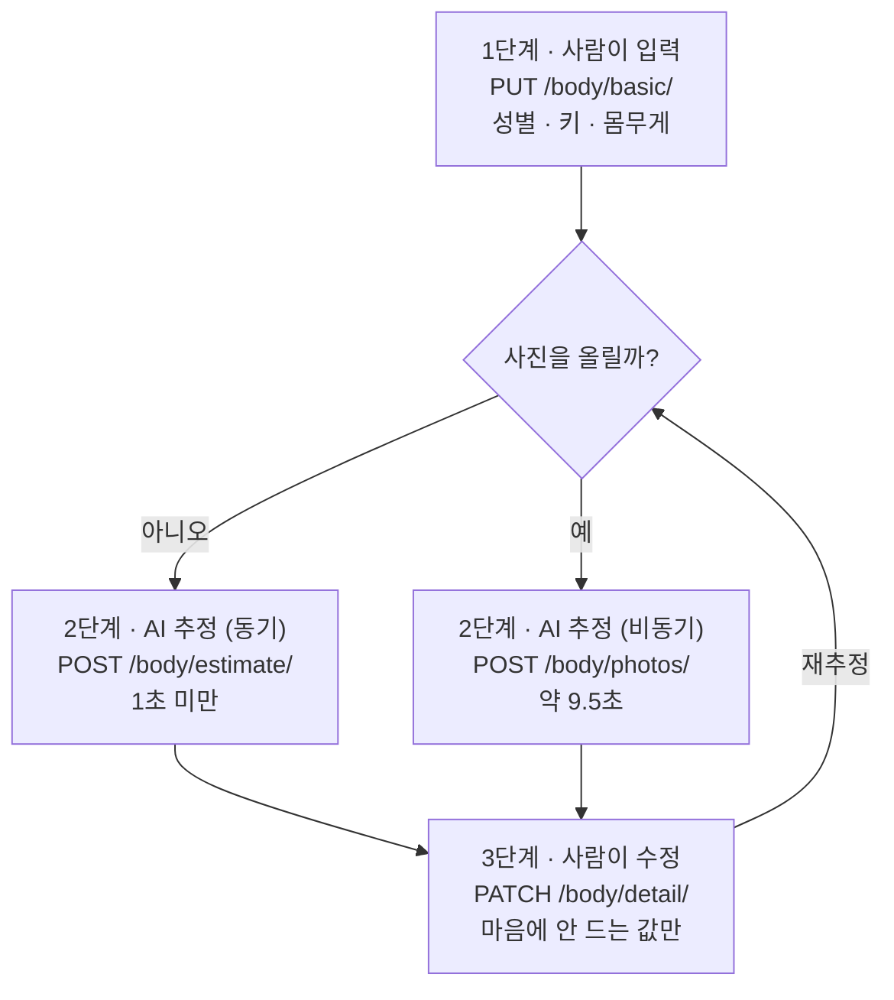
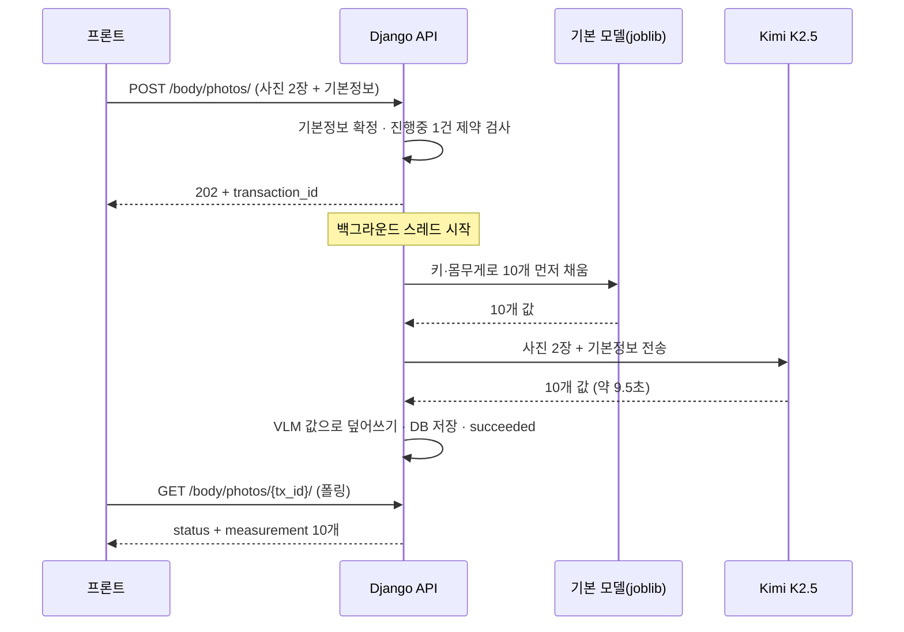

# 신체치수 추정 API 설계

## 1. 개요

온라인 의류 추천에는 사용자의 신체치수가 필요하지만, 대부분의 사용자는 자기 치수를
모른다. 그래서 두 가지 경로를 제공한다.

| 경로   | 입력               | 소요 시간 | 비용   | 용도                             |
| ------ | ------------------ | --------- | ------ | -------------------------------- |
| 무사진 | 성별·키·몸무게   | 1초 미만  | 0원    | 기본값. 진입 장벽이 없다         |
| 사진   | 위 + 전신 사진 2장 | 약 9.5초  | 약 6원 | 선택. 가슴·허리 정확도를 높인다 |

사진을 필수로 하면 이탈률과 비용을 동시에 떠안기 때문에, 무사진을 기본으로 두고
사진은 선택지로 뒀다.

---

## 2. 전체 흐름



### 2.1 각 단계의 원칙

| 단계 | 값을 만드는 주체 | 대상 필드                       |
| ---- | ---------------- | ------------------------------- |
| 1    | 사람             | 성별 · 키 · 몸무게            |
| 2    | AI               | 상세 14개 (치수 7개 + 길이 5개 + 비율 2개) |
| 3    | 사람             | 상세 14개 (치수 7개 + 길이 5개 + 비율 2개) |

1. **성별·키·몸무게는 AI가 만들지 않는다.** 저장되는 값은 항상 사람이 입력한 값이다.
2. 2단계 API도 성별·키·몸무게를 요청 본문으로 받을 수 있다. 이때 저장되는 값 역시
   사람이 보낸 값이므로 위 원칙에 어긋나지 않는다. 생략하면 1단계에서 저장한 값을 쓴다.
3. 결과가 어긋났다고 판단되면 사용자가 사진을 다시 찍어 재추정하거나 3단계에서 직접 고친다.

---

## 3. API 목록

| # | 메서드 | 경로                                               | 역할                               | 응답 코드 |
| - | ------ | -------------------------------------------------- | ---------------------------------- | --------- |
| 1 | GET    | `/api/v1/users/me/body/`                         | 신체치수 조회                      | 200       |
| 2 | PUT    | `/api/v1/users/me/body/basic/`                   | 성별·키·몸무게 입력 (셋 다 필수) | 200       |
| 3 | PATCH  | `/api/v1/users/me/body/detail/`                  | 상세 14개 수정 (전부 선택)         | 200       |
| 4 | POST   | `/api/v1/users/me/body/estimate/`                | 사진 없이 추정 (동기)              | 200       |
| 5 | POST   | `/api/v1/users/me/body/photos/`                  | 사진으로 추정 시작 (비동기)        | 202       |
| 6 | GET    | `/api/v1/users/me/body/photos/{transaction_id}/` | 사진 추정 결과 조회                | 200       |

### 3.1 요청 필드

| 필드            | ④ estimate | ⑤ photos      | 생략하면       |
| --------------- | ----------- | -------------- | -------------- |
| `gender`      | 선택        | 선택           | 저장된 값 사용 |
| `height`      | 선택        | 선택           | 저장된 값 사용 |
| `weight`      | 선택        | 선택           | 저장된 값 사용 |
| `front_image` | —          | **필수** | 400            |
| `side_image`  | —          | **필수** | 400            |

1. 저장된 값도 없고 요청에도 없으면 `400`을 반환한다.
2. ⑤는 `multipart/form-data`다. 필드명은 `front`·`side`가 아니라
   **`front_image`·`side_image`**이며, 틀리면 `400`이다.
3. 사진은 10MB 이하만 받는다.

---

## 4. 응답 형식

POST 응답 코드 자체는 동기(200)/비동기(202)라 같게 만들 수 없다. 대신
**결과 payload를 통일**해서 프론트가 하나의 파서로 처리하게 했다.

### 4.1 두 계열의 응답

| 계열       | 해당 API | 응답 형태                               |
| ---------- | -------- | --------------------------------------- |
| 조회·입력 | ① ② ③ | `measurement` 알맹이만                |
| 추정       | ④ ⑥    | `status`·`source` 등으로 감싼 형태 |

감싼 이유는 추정이 **실패할 수 있고 비동기**이기 때문이다. 조회·입력은 즉시
성공하므로 `status`나 `error_message`가 의미가 없다.

### 4.2 추정 계열 응답 (④와 ⑥이 완전히 동일)

```json
{
  "status": "succeeded",
  "source": "basic_info",
  "transaction_id": null,
  "measurement": {
    "gender": "male",
    "height": "175.5",
    "weight": "70.0",
    "chest": "98.7",
    "waist": "83.8",
    "hip": "94.0",
    "thigh": "55.2",
    "calf": "37.3",
    "arm": "32.0",
    "shoulder": "40.3",
    "thigh_length": "29.7",
    "calf_length": "39.2",
    "torso_length": "42.2",
    "leg_length": "68.9",
    "neck_length": "8.3",
    "thigh_calf_ratio": "0.762",
    "torso_leg_ratio": "0.613",
    "updated_at": "2026-08-05T12:33:54+09:00"
  },
  "error_message": null
}
```

| 필드               | 값                                                 |
| ------------------ | -------------------------------------------------- |
| `status`         | `in_progress` / `succeeded` / `failed`       |
| `source`         | `basic_info` (사진 없음) / `photo` (사진 있음) |
| `transaction_id` | 사진 추정일 때만 UUID, 무사진은`null`            |
| `measurement`    | 상세 14개는 항상 채워져 있고`null`이 없다        |
| `error_message`  | 실패했을 때만 사유, 아니면`null`                 |

### 4.3 프론트 처리

`measurement` 내부 17개 필드(기본 3개 + 상세 14개 + `updated_at`)는 6개 API가 모두

동일하므로 아래 한 줄로 통일할 수 있다.

```js
const m = res.measurement ?? res;
```

주의할 점 두 가지.

1. **`status`를 반드시 확인하고 화면을 그린다.** `in_progress` 상태에서도
   `measurement`에는 값이 들어 있는데, 이건 **직전 추정 결과**다. `status`를 보지 않으면
   옛날 숫자를 새 결과처럼 표시하게 된다.
2. 사용자당 진행 중인 사진 추정은 1건만 허용된다. 진행 중에 또 올리면 `400`이다.
   단 10분이 지나도 끝나지 않은 건은 자동으로 실패 처리되어 다시 올릴 수 있다.

---

## 5. 사진 경로 상세 흐름



### 5.1 2단으로 나눈 이유

VLM이 일부 부위를 빠뜨려도 응답에 빈칸이 생기지 않게 하기 위해서다. VLM이 10개를 다
주면 전부 사진 기반 값이 되고, 일부만 주면 그 부위만 기본 모델 값이 남는다.

### 5.2 사진 처리 정책

1. 사진은 **디스크·DB에 저장하지 않는다.** 요청에서 바이트로 읽어 추론에만 쓰고 버린다.
2. 업로드 파일은 응답이 끝나면 사라지므로, 접수 시점에 바이트로 읽어 스레드에 넘긴다.
3. 백그라운드는 현재 Python 스레드다. 서버가 재시작되면 진행 중이던 작업이 사라지는데,
   10분 타임아웃으로 실패 처리해 사용자가 막히지 않게 했다. AWS 이관 시 Celery/SQS로 교체한다.

---

## 6. 추정 모델

| 경로      | 모델                                      | 예측 부위                      |
| --------- | ----------------------------------------- | ------------------------------ |
| 사진 없음 | `hist_gradient_boosting` (scikit-learn) | 14개                           |
| 사진 있음 | Kimi K2.5 (OpenRouter)                    | 14개 (기본 모델 값 위에 덮어씀) |

### 6.1 모델 선정 근거

Validation 39명에 같은 프롬프트·같은 입력으로 후보 4개를 비교했다.

| 모델                  |    평균 MAE(cm) | 평균 시간(초) | 호출당 비용(USD) |
| --------------------- | --------------: | ------------: | ---------------: |
| **Kimi K2.5**   | **2.757** |         7.653 |         0.004492 |
| Grok 4.3              |           3.441 |         1.747 |         0.005977 |
| Qwen 3.7 Flash        |           3.597 |         5.106 |         0.000152 |
| Gemini 3.5 Flash-Lite |           3.962 |         5.985 |           미기록 |

정확도 1위인 Kimi를 채택했다. 다만 Qwen은 0.84cm 나쁜 대신 **약 30배 저렴**하므로,
서비스 규모가 커지면 Qwen으로 전환하는 것이 합리적이다.

---

## 7. 성능

### 7.1 평가 데이터

| 항목         | 최종값                    |
| ------------ | ------------------------- |
| 데이터       | SizeKorea 8차 실측 데이터 |
| Validation   | 36명                      |
| Test         | 143명                     |
| 총 평가 인원 | 179명                     |
| 외부 데이터  | 제외                      |

### 7.2 사진 vs 무사진 A/B (143명, 부위별 MAE cm)

| 부위   |          무사진 |            사진 |    차이 | 우세   |
| ------ | --------------: | --------------: | ------: | ------ |
| 가슴   |           4.755 | **3.532** | −1.222 | 사진   |
| 허리   |           4.117 | **3.187** | −0.930 | 사진   |
| 엉덩이 | **1.976** |           2.660 |  +0.685 | 무사진 |
| 허벅지 | **2.672** |           3.372 |  +0.700 | 무사진 |
| 종아리 | **1.173** |           1.466 |  +0.293 | 무사진 |
| 팔뚝   | **1.206** |           1.943 |  +0.738 | 무사진 |
| 어깨   | **1.421** |           3.594 |  +2.173 | 무사진 |

| 집계 기준                |          무사진 |            사진 | 승자   |
| ------------------------ | --------------: | --------------: | ------ |
| 3개 (가슴·허리·엉덩이) |           3.616 | **3.126** | 사진   |
| 7개 전체                 | **2.474** |           2.822 | 무사진 |

사람 단위로는 3개 기준에서 사진이 96명, 무사진이 47명 이겼다.

### 7.3 해석

1. **사진은 가슴·허리에서만 확실히 낫다.** 그런데 이 두 부위가 상의·하의 사이즈를
   결정하므로, 옷 추천 목적에서는 가장 중요한 개선이다.
2. **나머지 5개는 무사진이 낫다.** 특히 어깨는 사진 쪽이 2.17cm 나쁘다.
3. 따라서 **어느 지표를 보느냐에 따라 결론이 뒤집힌다.** 성능을 인용할 때는 3개 기준인지
   7개 기준인지를 반드시 함께 밝혀야 한다.
4. 부위별로 나은 쪽을 채택하는 하이브리드는 7개 기준 2.167cm로 두 방식 단독보다 낫다.
   현재 구조(기본 모델로 채운 뒤 VLM이 덮어씀)에서 덮어쓸 부위만 제한하면 적용할 수 있다.
   **아직 적용하지 않았다.**

### 7.4 응답 재현성

`temperature=0`으로 호출하지만 같은 사진·같은 입력에도 응답이 달라진다.
8/4 배치와 8/5 API 호출을 대조한 결과다.

| 대상              | 8/4와 일치한 부위 |
| ----------------- | ----------------- |
| `sizkorea_f111` | 0 / 7             |
| `sizkorea_m095` | 2 / 7             |

상용 API는 내부 배치·라우팅 때문에 완전 재현이 되지 않는다. 단건 결과로 성능을
판단하면 안 되며, 벤치마크는 응답을 CSV로 남겨 대조한다.

---

## 8. 환경 설정

| 환경변수                     | 기본값                                                                 | 설명                                    |
| ---------------------------- | ---------------------------------------------------------------------- | --------------------------------------- |
| `BODY_MODEL_PATH`          | `ml/body_measurement/artifacts/models/hist_gradient_boosting.joblib` | 무사진 추정 모델 경로                   |
| `ML_ROOT`                  | 저장소 루트의`ml/`                                                   | 추론 모듈 import 경로                   |
| `BODY_VLM_MODEL`           | `moonshotai/kimi-k2.5`                                               | 사진 추정에 쓸 OpenRouter 모델          |
| `BODY_VLM_TIMEOUT_SECONDS` | `120`                                                                | VLM 호출 타임아웃                       |
| `OPENROUTER_API_KEY`       | —                                                                     | Infisical에서 주입 (사진 추정에만 필요) |

### 8.1 도커 실행

시크릿이 Infisical에 있으므로 반드시 `infisical run`으로 감싼다. 그냥 실행하면
`REDIS_PASSWORD` 보간 오류로 뜨지 않는다.

```bash
# 코드를 받은 뒤에는 --build 필수. 빼면 옛 이미지가 그대로 떠서 신규 API가 404다.
infisical run --env=dev --silent -- \
  docker compose --profile api up -d --build api

# 인증 우회로 띄우려면 (로컬 전용). Infisical 값이 shell 변수를 덮어쓰므로
# 설정 지정은 infisical run 안쪽에서 한다.
infisical run --env=dev --silent -- sh -c \
  'DJANGO_SETTINGS_MODULE=config.settings.swagger_noauth docker compose --profile api up -d api'
```

### 8.2 주의사항

1. **`scikit-learn`은 반드시 `1.8.0`이어야 한다.** 모델 아티팩트가 1.8.0으로 저장돼 있어
   1.9.0에서 열면 `ModuleNotFoundError: No module named '_loss'`로 실패한다.
   재학습하면 `api/requirements.txt`의 핀도 함께 올린다.
2. `scipy`·`numpy`도 함께 고정한다. pickle이 두 라이브러리의 내부 구조를 참조하기 때문이다.
   현재 핀은 모델을 학습·검증한 실제 환경 값(`scipy 1.17.1`, `numpy 2.4.3`)이다.
3. 이미지 빌드 컨텍스트가 `./api`라 `ml/`이 이미지에 들어가지 않는다. compose에서
   `./ml:/ml:ro`로 마운트한다.

---

## 9. 프롬프트 파일

| 파일                                        | 용도               | 묻는 부위 |
| ------------------------------------------- | ------------------ | --------- |
| `prompts/body_measurement_prompt_full.j2` | 서빙               | 10개      |
| `prompts/body_measurement_prompt.j2`      | 모델 선정 벤치마크 | 3개       |

벤치마크 프롬프트를 3개짜리로 남겨둔 이유는 `reports/model_evaluation_summary.md`에
기록된 MAE를 재현할 수 있게 하기 위해서다. 서빙 프롬프트를 바꿔도 과거 측정치는 그대로 남는다.

---

## 10. 검증 결과 (2026-08-05)

| 항목                                                              | 결과                                   |
| ----------------------------------------------------------------- | -------------------------------------- |
| `apps.users` 테스트                                             | 65개 통과                              |
| `apps.api_docs` 테스트                                          | 2개 통과                               |
| 엔드포인트 6개 정상 경로                                          | 전부 200/202                           |
| 에러 처리 (없는 tx / 범위초과 / 성별오타 / 사진누락 / 필드명오류) | 404 1건 + 400 4건                      |
| Swagger 스키마 노출                                               | body 6개 전부                          |
| 응답 스키마 통일                                                  | ④ ↔ ⑥ 완전 동일                     |
| 사진 경로 HTTP 종단                                               | 여·남 각 1건 성공, 10개 값 반환 |

---

## 11. 구현 상태와 남은 과제

| 항목                            | 상태                 |
| ------------------------------- | -------------------- |
| 무사진 추정 API                 | 완료                 |
| 사진 추정 API                   | 완료                 |
| 결과 형식 통일                  | 완료                 |
| 사진 모델 확정                  | 완료 (Kimi K2.5)     |
| Test 145명 평가                 | 완료                 |
| 사진 vs 무사진 A/B              | 완료                 |
| HTTP 종단 검증                  | 완료                 |
| 하이브리드 적용 (부위별 채택)   | 미적용               |
| 얼굴 블러 전처리                | 함수만 있고 미연결   |
| 백그라운드 스레드 → Celery/SQS | 미적용 (AWS 이관 시) |
| 프론트 연동                     | 미착수               |

### 11.1 서비스화 전 반드시 해결할 것

전신 사진은 민감정보다. 현재는 저장하지 않고 추론에만 쓰지만 외부 API(OpenRouter)로
전송된다.

얼굴 블러 함수는 이미 있다 — `ml/body_measurement/src/utils/privacy.py`의 `blur_face()`가
OpenCV Haar Cascade로 얼굴을 검출해 가우시안 블러를 적용하고, 검출에 실패하면 상단 중앙을
강제로 블러하는 fallback까지 갖고 있다.

**문제는 이 함수가 추론 경로에서 호출되지 않는다는 점이다.** `inference.py`는 업로드된
바이트를 그대로 OpenRouter로 보낸다. 서비스화 전에 `estimate_from_photos()`가 VLM을
호출하기 전 단계에 `blur_face()`를 끼워 넣어야 한다.

### 11.2 비용

호출당 약 $0.005(6원)다. Test 145명 평가 전체가 $0.71이었다. 사용자 규모가 커지면
무사진을 기본으로 유지하고, 사진 경로는 30배 저렴한 Qwen 3.7 Flash로 전환하는 경로를 열어 뒀다.
