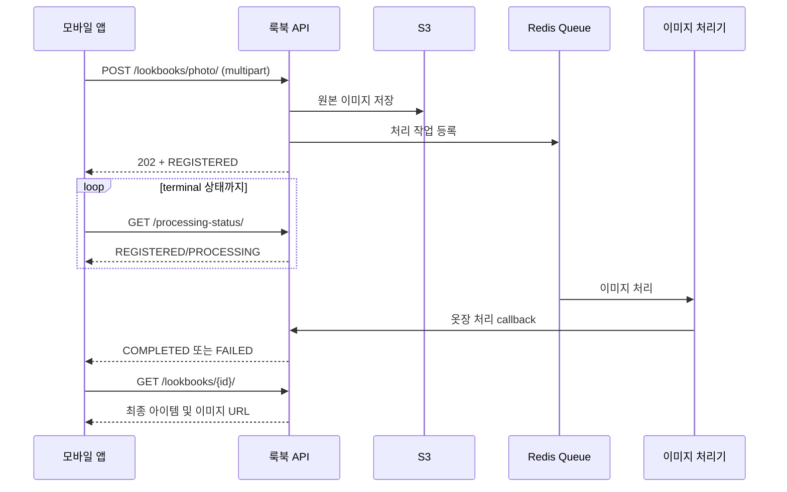

# 룩북 API 설계서

> 기준 코드: `api/apps/lookbook`, `mobile/src/lib/lookbookApi.ts`
>
> 기준일: 2026-08-27
> Base URL: `/api/v1`

## 1. 목적과 범위

룩북 API는 사용자가 자신의 착장을 저장·조회·수정·삭제하고, 공개된 착장이나 운영자가 큐레이션한 룩을 탐색할 수 있도록 한다. 등록 방식은 다음 세 가지다.

| `source_type` | 의미 | 최초 응답 |
|---|---|---|
| `PHOTO_UPLOAD` | 착장 사진을 업로드하고 이미지 처리로 아이템을 추출 | `202 Accepted`, 비동기 처리 |
| `WARDROBE_SELECTED` | 내 옷장의 아이템을 직접 선택해 구성 | `201 Created`, 즉시 완료 |
| `GOLDEN_LOOK` | 오늘의 룩 추천 카드를 저장 | 추천 도메인에서 생성, 즉시 완료 |

이 문서는 `apps.lookbook.urls`에 공개된 HTTP API를 기준으로 한다. 추천 카드 저장과 이미지 처리 콜백의 내부 계약은 각각 추천·옷장 도메인이 소유하므로 여기서는 연동 관계만 설명한다.

## 2. 공통 규칙

### 2.1 인증

- 기본 인증은 JWT이며 헤더는 `Authorization: Bearer <access_token>`을 사용한다.
- 별도 표기가 없는 API는 로그인 사용자만 호출할 수 있다. 미인증 요청은 `401 Unauthorized`다.
- `GET /lookbooks/public/`과 `/lookbooks/discover/` 계열은 비회원도 호출할 수 있다.
- 내 룩북 상세·상태 API는 현재 로그인한 사용자가 소유한 데이터만 조회한다. 다른 사용자의 ID도 `404 Not Found`로 응답한다.

### 2.2 상태

| 상태 | 의미 |
|---|---|
| `REGISTERED` | 사진과 룩북 레코드 등록 완료, 처리 대기 |
| `PROCESSING` | 이미지 처리 진행 중 |
| `COMPLETED` | 결과 이용 가능 |
| `FAILED` | 처리 실패 |

사진 등록은 `REGISTERED → PROCESSING → COMPLETED/FAILED`로 진행한다. 옷장 직접 선택과 골든 룩 저장은 별도 이미지 추출이 없어 곧바로 `COMPLETED`가 된다.

### 2.3 페이지네이션

목록 응답은 offset 방식이다.

```json
{
  "count": 42,
  "next_offset": 20,
  "results": []
}
```

- 기본 `limit`: 20
- 사용자 룩북·공개 피드의 최대 `limit`: 100
- 큐레이션 탐색의 최대 `limit`: 50
- 다음 페이지가 없으면 `next_offset`은 `null`

## 3. 엔드포인트 요약

| Method | Endpoint | 인증 | 설명 |
|---|---|---:|---|
| GET | `/lookbooks/discover/` | 불필요 | 운영자 큐레이션 룩 탐색 |
| GET | `/lookbooks/discover/{look_id}/` | 불필요 | 큐레이션 룩 상세 |
| GET | `/lookbooks/discover/{external_id}/cover/` | 불필요 | 큐레이션 룩 커버 이미지 |
| POST | `/lookbooks/photo/` | 필요 | 사진 기반 룩북 등록 |
| POST | `/lookbooks/wardrobe/` | 필요 | 옷장 아이템 기반 룩북 등록 |
| GET | `/lookbooks/public/` | 불필요 | 사용자가 공개한 룩북 피드 |
| GET | `/lookbooks/` | 필요 | 내 룩북 목록 |
| GET | `/lookbooks/{lookbook_id}/` | 필요 | 내 룩북 상세 |
| PATCH | `/lookbooks/{lookbook_id}/` | 필요 | 룩북 메타데이터 수정 |
| DELETE | `/lookbooks/{lookbook_id}/` | 필요 | 룩북 삭제 |
| GET | `/lookbooks/{lookbook_id}/processing-status/` | 필요 | 사진 처리 상태 조회 |

## 4. 공통 룩북 응답

룩북 생성·목록·상세·수정은 다음 구조를 사용한다.

```json
{
  "id": "4ea462c8-5fef-4f87-98bb-c11ef9d14e53",
  "source_type": "WARDROBE_SELECTED",
  "golden_id": "",
  "image_s3_key": "lookbook/12/4ea462c8.../items/000-...jpg",
  "image_url": "https://presigned-url.example/...",
  "schedule": "금요일 팀 회의",
  "tpo": ["출근"],
  "hashtags": ["출근", "미니멀"],
  "skipped_categories": [],
  "status": "COMPLETED",
  "is_public": false,
  "calendar": {
    "id": "baaa479a-02fb-4ed1-bba7-a635a1036018",
    "date": "2026-08-21"
  },
  "wardrobe_items": [
    {
      "link_id": "7c29717a-e806-4c0c-9387-d8c5aeb0536b",
      "wardrobe_item_id": "704150e4-b268-4627-95bd-47fc40165408",
      "link_type": "SELECTED",
      "image_url": "https://presigned-url.example/...",
      "sort_order": 0,
      "snapshot": {},
      "added_to_closet_at": "2026-08-21T09:00:00+09:00"
    }
  ],
  "created_at": "2026-08-21T09:00:00+09:00",
  "updated_at": "2026-08-21T09:00:00+09:00"
}
```

`calendar`는 연결된 기록이 없으면 `null`이다. `wardrobe_item_id`와 `added_to_closet_at`은 골든 룩처럼 사용자 옷장에 아직 들어오지 않은 아이템이면 `null`일 수 있다. `image_url`은 S3 presigned URL이므로 영구 저장하지 말고 응답을 다시 조회해 갱신한다.

## 5. 등록 API

### 5.1 사진으로 등록

`POST /api/v1/lookbooks/photo/`

`Content-Type: multipart/form-data`

| 필드 | 타입 | 필수 | 기본값 | 설명 |
|---|---|---:|---|---|
| `image` | file | O | - | jpeg, png, webp, heic / 최대 15MB |
| `wardrobe_item_ids` | UUID[] | X | `[]` | 사진 속 이미 보유한 옷. multipart에서 같은 키를 반복 전송 |
| `schedule` | string | X | `""` | 일정 설명 |
| `tpo` | string[] | X | `[]` | TPO 목록 |
| `hashtags` | string[] | X | `[]` | 해시태그 목록 |
| `calendar_date` | date | X | `null` | 캘린더에 함께 기록할 날짜, `YYYY-MM-DD` |
| `overwrite_calendar` | boolean | X | `false` | 해당 날짜의 기존 기록 교체 여부 |
| `is_public` | boolean | X | `false` | 공개 피드 노출 여부 |

```bash
curl -X POST "$BASE_URL/api/v1/lookbooks/photo/" \
  -H "Authorization: Bearer $ACCESS_TOKEN" \
  -F "image=@look.jpg" \
  -F "wardrobe_item_ids=704150e4-b268-4627-95bd-47fc40165408" \
  -F "tpo=출근" \
  -F "hashtags=미니멀" \
  -F "calendar_date=2026-08-21" \
  -F "is_public=false"
```

성공 시 `202 Accepted`와 공통 룩북 응답을 반환한다. 응답 직후에는 일반적으로 `REGISTERED` 상태이며, 클라이언트는 처리 상태 API를 폴링한다. 배열은 `hashtags[0]` 형식이 아니라 동일 키를 반복한다.

### 5.2 옷장 아이템으로 등록

`POST /api/v1/lookbooks/wardrobe/`

`Content-Type: application/json`

```json
{
  "wardrobe_item_ids": [
    "704150e4-b268-4627-95bd-47fc40165408",
    "a9d408f8-a873-487d-a5f9-c9c4d707532a"
  ],
  "schedule": "금요일 팀 회의",
  "tpo": ["출근"],
  "hashtags": ["출근", "미니멀"],
  "calendar_date": "2026-08-21",
  "overwrite_calendar": false,
  "is_public": false
}
```

- `wardrobe_item_ids`는 하나 이상이어야 하며 중복 ID를 허용하지 않는다.
- 로그인 사용자가 소유하지 않았거나 존재하지 않는 옷장 ID가 포함되면 `400 Bad Request`다.
- 첫 번째 선택 아이템 이미지가 룩북 대표 이미지가 된다.
- 성공 시 `201 Created`, 상태는 `COMPLETED`다.

### 5.3 캘린더 동시 등록 규칙

- `calendar_date`를 생략하면 룩북만 생성한다.
- 해당 날짜에 기록이 있으면 `409 CALENDAR_DATE_CONFLICT`를 반환한다.
- 사용자 확인 후 같은 요청을 `overwrite_calendar: true`로 다시 보내면 기존 기록을 교체한다.
- 기존 캘린더 이미지가 처리 중이면 교체하지 않고 `409 CALENDAR_BUSY`를 반환한다.
- `calendar_date` 없이 `overwrite_calendar: true`만 보내면 `400 Bad Request`다.

```json
{
  "calendar_date": ["해당 날짜의 캘린더가 이미 존재합니다."],
  "code": "CALENDAR_DATE_CONFLICT",
  "date": "2026-08-21"
}
```

## 6. 내 룩북 조회·수정·삭제

### 6.1 목록

`GET /api/v1/lookbooks/?hashtag=출근&status=COMPLETED&limit=20&offset=0`

| Query | 설명 |
|---|---|
| `hashtag` | JSON 배열에 해당 문자열이 포함된 룩북만 조회 |
| `status` | `REGISTERED`, `PROCESSING`, `COMPLETED`, `FAILED` 중 하나 |
| `limit` | 1~100, 기본 20 |
| `offset` | 0 이상, 기본 0 |

본인의 룩북만 최신순으로 반환한다.

### 6.2 상세

`GET /api/v1/lookbooks/{lookbook_id}/`

성공 시 공통 룩북 응답을 반환한다. 없거나 본인 소유가 아니면 `404 Not Found`다.

### 6.3 메타데이터 수정

`PATCH /api/v1/lookbooks/{lookbook_id}/`

```json
{
  "schedule": "수정된 일정",
  "tpo": ["데이트"],
  "hashtags": ["데이트", "캐주얼"],
  "is_public": true
}
```

수정 가능한 필드는 `schedule`, `tpo`, `hashtags`, `is_public`뿐이다. 이미지나 아이템 구성은 수정할 수 없으며 변경하려면 삭제 후 다시 등록한다. 선언되지 않은 필드는 `400 Bad Request`로 거절한다.

### 6.4 삭제

`DELETE /api/v1/lookbooks/{lookbook_id}/`

- 성공: `204 No Content`
- 없음 또는 타인 소유: `404 Not Found`
- `REGISTERED` 또는 `PROCESSING` 상태: `409 Conflict`

삭제 시 룩북과 연결 데이터 및 룩북 전용 S3 객체를 정리한다. 골든 룩처럼 원본 버킷의 객체를 참조만 하는 이미지는 원본을 삭제하지 않는다.

## 7. 처리 상태 조회

`GET /api/v1/lookbooks/{lookbook_id}/processing-status/`

```json
{
  "lookbook_id": "4ea462c8-5fef-4f87-98bb-c11ef9d14e53",
  "status": "PROCESSING",
  "processing_required": true,
  "is_terminal": false,
  "result_available": false,
  "skipped_categories": ["상의"],
  "item_counts": {
    "total": 2,
    "selected": 1,
    "extracted": 1
  },
  "failure": null,
  "processing_started_at": "2026-08-21T09:00:03+09:00",
  "processing_completed_at": null,
  "updated_at": "2026-08-21T09:00:03+09:00"
}
```

- `processing_required`: 사진 등록일 때만 `true`
- `is_terminal`: `COMPLETED` 또는 `FAILED`면 `true`
- `result_available`: `COMPLETED`일 때만 `true`
- 실패 시 `failure`에 공개 가능한 `code`, `message`를 반환한다.

실패 코드는 `QUEUE_ENQUEUE_FAILED`, `NO_ITEM_EXTRACTED`, `IMAGE_PROCESSING_FAILED`다. 클라이언트는 `is_terminal`이 `true`가 될 때까지 폴링하고, 완료 후 상세 API를 다시 조회해 최종 아이템과 presigned URL을 받는다.

## 8. 공개 피드와 큐레이션 탐색

### 8.1 사용자 공개 피드

`GET /api/v1/lookbooks/public/?hashtag=여행&limit=20&offset=0`

비회원 호출이 가능하며 `is_public=true`이면서 `COMPLETED`인 사용자 룩북만 최신순으로 반환한다. 응답은 공통 목록 형식이다. 같은 쿼리 serializer를 사용하지만 공개 피드에서는 `status` 값이 필터에 사용되지 않는다.

### 8.2 운영자 큐레이션 룩 목록

`GET /api/v1/lookbooks/discover/?query=캐주얼&tag=데이트&gender=WOMAN&limit=20&offset=0`

| Query | 설명 |
|---|---|
| `query` | 제목 또는 부제목 부분 검색, 최대 100자 |
| `tag` | 태그 정확 일치, 최대 30자 |
| `gender` | `WOMAN` 또는 `MAN` |
| `limit` | 1~50, 기본 20 |
| `offset` | 0 이상 |

```json
{
  "count": 1,
  "next_offset": null,
  "results": [
    {
      "id": "curated-woman-casual-001",
      "gender": "WOMAN",
      "title": "주말 캐주얼 룩",
      "subtitle": "편안한 나들이 코디",
      "image": "/api/v1/lookbooks/discover/woman-casual-001/cover/",
      "tags": ["캐주얼", "나들이"],
      "total_price": 129000,
      "items": [],
      "reasons": []
    }
  ]
}
```

각 `items`에는 `id`, `slot`, `category_large`, `category_small`, `name`, `brand`, `image`, `price`, `mall_name`, `link`, `similar_products`가 포함된다. `similar_products`는 같은 카테고리와 관련 키워드를 만족하는 네이버 상품을 아이템당 최대 3개 제공하며, 한 페이지 안에서는 중복 상품을 제거한다.

### 8.3 큐레이션 룩 상세·커버

- `GET /api/v1/lookbooks/discover/{look_id}/`: 목록의 룩 객체 하나를 반환한다. `look_id`는 `curated-` 접두사가 있거나 없어도 된다.
- `GET /api/v1/lookbooks/discover/{external_id}/cover/`: 원본 PNG를 반환한다.
- `GET /api/v1/lookbooks/discover/{external_id}/cover/?w=400`: 400px JPEG 썸네일을 반환한다. 지원 폭은 서비스 구현 기준 `400` 또는 `800`이며 썸네일은 하루 동안 캐시된다.

## 9. 오류 응답

| HTTP | 상황 | 대표 응답/코드 |
|---:|---|---|
| 400 | 필수 필드 누락, 타입·형식 오류, 중복 옷장 ID, 알 수 없는 필드 | 필드별 오류 배열 |
| 401 | JWT 없음 또는 유효하지 않음 | 인증 오류 |
| 404 | 룩북·큐레이션 룩 없음, 타인 소유 룩북 접근 | `detail` |
| 409 | 캘린더 날짜 중복 | `CALENDAR_DATE_CONFLICT` |
| 409 | 처리 중인 캘린더 교체 | `CALENDAR_BUSY` |
| 409 | 처리 중인 룩북 삭제 | 현재 `status` 포함 |
| 503 | S3 저장 실패 | 재시도 안내 |
| 503 | Redis 큐 등록 실패 | 생성된 룩북 `id`, `FAILED` 상태 |

입력 JSON은 선언된 필드만 허용한다. 서버 내부 오류 문구에 의존하기보다 HTTP 상태와 명시된 `code`를 우선 분기 기준으로 사용한다.

## 10. 구현 흐름



## 11. 소스 기준과 검증 범위

| 영역 | 기준 파일 |
|---|---|
| URL·HTTP 동작 | `api/apps/lookbook/urls.py`, `views.py` |
| 요청 검증·응답 스키마 | `api/apps/lookbook/serializers.py` |
| 상태·출처·오류 코드 | `api/apps/lookbook/contracts.py` |
| 생성·삭제·캘린더 연결 | `api/apps/lookbook/services/lookbook_service.py` |
| 큐레이션 탐색 | `api/apps/lookbook/services/discovery.py` |
| 저장 경로·서명 URL | `api/apps/lookbook/services/storage.py` |
| 모바일 호출 방식 | `mobile/src/lib/lookbookApi.ts` |
| 행위 검증 | `api/apps/lookbook/tests/` |

구현 변경 시 URL, serializer, 모바일 DTO와 이 문서를 함께 갱신한다. OpenAPI 자동 생성 문서는 serializer 수준의 필드 확인에 활용하고, 비동기 상태 전이·캘린더 충돌·삭제 정책은 본 문서를 기준으로 한다.
