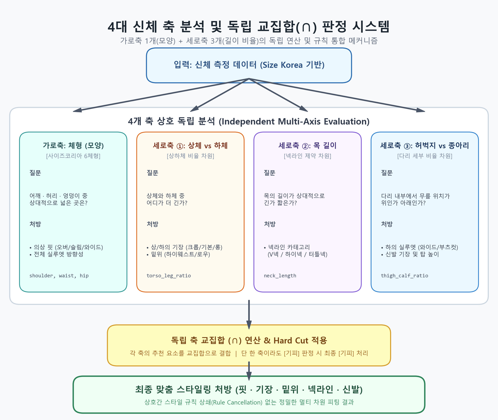

# 체형·비율 규칙 (v3, 사이즈코리아 상반신 체형)

> **폐기된 v3 기록:** 현재 운영 계약은 [`04-body-threshold-contract-v4.md`](04-body-threshold-contract-v4.md)다. v4는 clean 172명 SSOT, 성별 경험 백분위, 5체형만 사용하며 `standard`를 `rectangle`에 흡수한다.

- **작성일**: 2026-08-10 (v3)
- **판단 원천**: [`rules/body_shape_thresholds.json`](../rules/body_shape_thresholds.json) (계산값) · [`rules/body_fit_rules.json`](../rules/body_fit_rules.json) (수기) · [`rules/sizekorea_body_shape_reference.json`](../rules/sizekorea_body_shape_reference.json) (출처 원문)
- **생성 스크립트**: [`tools/derive_body_thresholds.py`](../tools/derive_body_thresholds.py)
- **변경 사항**: v3는 사이즈코리아가 실제로 쓰는 분류법(Rasband 1994 상반신 체형)을 따른다.

---

## 0. 변경 이력

| 버전                | 가로축이 나눈 것        | 클래스                                                | 1차 분류 기준                                                        | 상태           |
| ------------------- | ----------------------- | ----------------------------------------------------- | -------------------------------------------------------------------- | -------------- |
| v1                  | 체형 (모양)             | 5체형 (라운드/역삼각/모래시계/직사각/삼각)            | shoulder/hip·waist/hip p33/p67 (실측 181명)                         | 폐기           |
| v2                  | **사이즈 (크기)** | 6단계 (A~F)                                           | 가슴·허리·엉덩이 cm 절대값                                         | **폐기** |
| **v3 (현재)** | **체형 (모양)**   | **6체형 (둥근/역삼각/삼각/모래시계/사각/표준)** | **shoulder/hip·waist/hip 성별×연령대 백분위 (실측 5,092명)** | **현재** |

## 1. 축을 네 개로 나눈다



"체형"이라는 한 단어에 성격이 다른 것들이 섞여 있다. 섞어 두면 규칙이 서로를 지운다.

- **가로축 1개(모양) + 세로축 3개(길이 비율)** 로 나눈다.

| 축                                            | 묻는 것                                        | 처방하는 것                                                    | 측정                                     |
| --------------------------------------------- | ---------------------------------------------- | -------------------------------------------------------------- | ---------------------------------------- |
| **가로축 — 체형 (사이즈코리아 6체형)** | 어깨·허리·엉덩이 중 어디가 상대적으로 넓은가 | **핏**(오버/슬림/와이드), 실루엣                         | ✅ 가능 (`shoulder`,`waist`,`hip`) |
| **세로축 ① 상체:하체**                 | 상체와 하체 중 어디가 긴가                     | **기장**(크롭/기본/롱), **밑위**(하이웨스트/로우)  | ✅ 가능 (`torso_leg_ratio`)            |
| **세로축 ② 목 길이**                   | 목이 긴가 짧은가                               | **넥라인**(V넥/하이넥/터틀넥)                            | ✅ 가능 (`neck_length`)                |
| **세로축 ③ 허벅지:종아리**             | 다리 안에서 무릎이 위인가 아래인가             | **하의 실루엣**(와이드/슬림/부츠컷), **신발 기장** | ✅ 가능 (`thigh_calf_ratio`)           |

- 네 축은 모두 **독립**이다.
- 같은 역삼각체형이라도 상체가 길면 크롭 상의를, 짧으면 롱 상의를 입는다.
- 목이 짧으면 그 위에 다시 V넥 제약이 붙는다.
- 최종 권장은 각 축의 권장을 **교집합**으로 합치고, 어느 한 축이라도 기피면 기피로 처리한다.

> **세로축 ①과 ③은 다른 차원이다.** 다리 전체 길이가 같아도 무릎 위치에 따라 다리가 짧아 보일 수 있다. 그래서 따로 측정해야 한다.

---

## 2. 가로축 — 사이즈코리아 체형 분류

### 2-1. 출처와 분류 체계

사이즈코리아 「한국인의 체형 분류 › 성별 및 연령별 체형」 원문:

> "의류 학회의 보편적 분류법인 Rasband(1994)에 의한 방법에 따라 어깨, 허리, 엉덩이의 크기에 따라 상반신의 형태를 아래 8가지 항목으로 분류하고 있습니다."

| # | 체형               | slug                  | 우리 운영 |
| - | ------------------ | --------------------- | --------- |
| 1 | 이상체형(표준체형) | `standard`          | ✅        |
| 2 | 삼각체형           | `triangle`          | ✅        |
| 3 | 역삼각형체형       | `inverted_triangle` | ✅        |
| 4 | 사각체형           | `rectangle`         | ✅        |
| 5 | 모래시계형         | `hourglass`         | ✅        |
| 6 | 마름모꼴체형       | `diamond`           | ⛔ 제외   |
| 7 | 둥근체형           | `round`             | ✅        |
| 8 | 튜브체형           | `tube`              | ⛔ 제외   |

### 2-2. 마름모꼴·튜브를 제외하는 이유

사이즈코리아 자신이 8개를 다 운영하지 않는다. 같은 페이지 원문:

> "대부분 둘레항목이 하나의 요소로 분류됨에 따라, 위의 분류법 중에서 모래시계형~튜브체형에 이르는 체형으로의 상세한 분류는 추가적인 분석이 필요합니다."

우리 표본에서도 배정이 사실상 불가능하다 — 8차 실측 5,092명 기준:

| 조건                                                                                      | 여 (2,773)   | 남 (2,319)   |
| ----------------------------------------------------------------------------------------- | ------------ | ------------ |
| **마름모꼴** — 허리가 가슴·엉덩이보다 큼 (`waist≥hip` 그리고 `waist≥chest`) | 12명 (0.43%) | 22명 (0.95%) |
| **튜브** — BMI<18.5 그리고 허리 굴곡 없음 (`waist/hip ≥ p67`)                   | 1명 (0.04%)  | 0명 (0%)     |

**추론기가 절대 내놓을 수 없는 라벨을 스키마에 넣지 않는다.** 넣으면 `body_type` payload에 영원히 비어 있는 값이 생기고, 나중에 "왜 마름모꼴 추천은 한 번도 안 나오지?"라는 유령 버그를 만든다. 근거는 `body_shape_thresholds.json`의 `taxonomy.excluded_evidence`에 숫자로 남겼다.

### 2-3. 임계값은 성별 × 연령대 백분위다

"어깨/엉덩이 0.42면 넓은 것"이라고 단정할 근거가 없다. 대신 **같은 성별·같은 연령대 안에서 상위 33%인가**로 정의한다.
근거가 감이 아니라 표본이 되고, 표본이 갱신되면 스크립트 한 번으로 임계값도 갱신된다.

- **표본**: 사이즈코리아 **8차 인체치수조사(2020~2024) 직접측정** — 여 2,773명 / 남 2,319명 (총 5,092명)
  - 원본: `8차 인체치수조사(2020~24)_치수데이터(공개용).xlsx` › `(1~2차년도) 직접측정` 시트
  - v2까지 쓰던 181명 VLM 라벨셋 대비 **28배**. 연령대별로 쪼개도 최소 290명이 남는다.
- **성별로 나누는 이유**: 남녀는 골격 자체가 달라 같은 잣대를 쓸 수 없다 (남 `waist/hip` 중앙값 0.898 vs 여 0.815).
- **연령대로 나누는 이유**: 사이즈코리아도 성별·연령별로 따로 군집을 만든다. 20대 여성의 `waist/hip` p90은 0.838인데 전 연령 p90은 0.921 — 같은 사람이 연령대 기준으로는 둥근체형이고 전체 기준으로는 아니다.

**20대 임계값** (전체 값은 JSON 참조):

| 지표                              | 여 20대 p33 | 여 20대 p67 | 여 20대 p90 | 남 20대 p33 | 남 20대 p67 | 남 20대 p90 |
| --------------------------------- | ----------- | ----------- | ----------- | ----------- | ----------- | ----------- |
| `shoulder/hip` (상하체 폭 균형) | 0.3669      | 0.3877      | 0.4043      | 0.4045      | 0.4264      | 0.4490      |
| `waist/hip` (허리 굴곡)         | 0.7530      | 0.7897      | 0.8379      | 0.8255      | 0.8704      | 0.9098      |

> ⚠️ **`shoulder`는 너비(cm), `hip`은 둘레(cm)라 `shoulder/hip`은 차원이 섞인 비율이다.** Rasband의 원래 정의는 어깨너비 대 엉덩이**너비** 비교인데 우리 입력(`BodyMeasurement`)에 엉덩이너비가 없다. 임계값이 같은 표본의 백분위라 내부적으로는 일관되지만, **이 절대값을 다른 데이터셋과 비교하면 안 된다.** 엉덩이너비가 입력에 추가되면 이 비율부터 교체한다.
>
> `shoulder`는 원본의 **어깨사이너비**(평균 37.3cm)다. 어깨사이길이(42.2cm)나 어깨가쪽사이길이(40.7cm)가 아니다. `ml/` 파이프라인이 학습한 컬럼과 맞추기 위한 것이고, 바꾸면 임계값과 모델 출력의 축이 어긋난다.

### 2-4. 판정 순서 = 정의

```
1. waist/hip ≥ p90     → 둥근체형     (round)
2. shoulder/hip ≥ p67  → 역삼각체형   (inverted_triangle)
3. shoulder/hip ≤ p33  → 삼각체형     (triangle)
4. waist/hip ≤ p33     → 모래시계체형 (hourglass)
5. waist/hip ≥ p67     → 사각체형     (rectangle)
6. 그 외                → 표준체형     (standard)
```

**허리를 맨 먼저 보는 이유**: 허리가 엉덩이에 육박하면 어깨 폭과 무관하게 스타일링 과제가 "폭 균형"이 아니라 "세로선 만들기"로 바뀐다. 이 경우 어깨 기반 처방은 효과가 없다.

**둥근체형 관문을 p67 → p90으로 올린 이유**: v1/v2 코드는 `waist/hip ≥ p67`을 첫 관문으로 뒀는데, 그러면 **정의상 표본의 1/3이 둥근체형**이 된다. 둥근체형의 처방은 "슬림·오버 둘 다 기피, 크롭 기피"로 제약이 가장 센데, 그걸 3명 중 1명에게 거는 건 과잉이다. p90으로 올려 복부가 실제로 지배적인 10%만 남기고, 그 아래 구간(p67~p90)은 굴곡이 없다는 사실만 반영해 사각체형으로 보낸다.

### 2-5. 실제 분포 (5,092명 자동 분류 결과)

**여성 (2,773명)**

| 체형         | 전체        | 20대        | 30대        | 40대        | 50대        | 60대+       |
| ------------ | ----------- | ----------- | ----------- | ----------- | ----------- | ----------- |
| 역삼각체형   | 860 (31.0%) | 181 (31.5%) | 206 (31.4%) | 179 (31.0%) | 156 (31.2%) | 138 (29.6%) |
| 삼각체형     | 774 (27.9%) | 154 (26.8%) | 177 (27.0%) | 163 (28.2%) | 140 (28.0%) | 140 (30.0%) |
| 모래시계체형 | 329 (11.9%) | 68 (11.8%)  | 92 (14.1%)  | 66 (11.4%)  | 52 (10.4%)  | 51 (10.9%)  |
| 표준체형     | 327 (11.8%) | 70 (12.2%)  | 73 (11.2%)  | 66 (11.4%)  | 59 (11.8%)  | 59 (12.7%)  |
| 둥근체형     | 281 (10.1%) | 58 (10.1%)  | 67 (10.2%)  | 58 (10.1%)  | 51 (10.2%)  | 47 (10.1%)  |
| 사각체형     | 202 (7.3%)  | 44 (7.6%)   | 40 (6.1%)   | 45 (7.8%)   | 42 (8.4%)   | 31 (6.7%)   |

**남성 (2,319명)**

| 체형         | 전체        | 20대        | 30대        | 40대        | 50대       | 60대+       |
| ------------ | ----------- | ----------- | ----------- | ----------- | ---------- | ----------- |
| 역삼각체형   | 735 (31.7%) | 195 (32.0%) | 164 (33.3%) | 147 (31.7%) | 88 (30.3%) | 141 (30.5%) |
| 삼각체형     | 629 (27.1%) | 154 (25.2%) | 130 (26.4%) | 131 (28.2%) | 83 (28.6%) | 131 (28.3%) |
| 모래시계체형 | 263 (11.3%) | 73 (12.0%)  | 59 (12.0%)  | 45 (9.7%)   | 35 (12.1%) | 51 (11.0%)  |
| 표준체형     | 274 (11.8%) | 80 (13.1%)  | 57 (11.6%)  | 54 (11.6%)  | 32 (11.0%) | 51 (11.0%)  |
| 둥근체형     | 234 (10.1%) | 62 (10.2%)  | 50 (10.1%)  | 46 (9.9%)   | 30 (10.3%) | 46 (10.0%)  |
| 사각체형     | 184 (7.9%)  | 46 (7.5%)   | 33 (6.7%)   | 41 (8.8%)   | 22 (7.6%)  | 42 (9.1%)   |

**빈 클래스가 없고, 어느 하나도 35%를 넘지 않는다** — 6분류가 표본에서 실제로 작동한다는 확인이다. 어느 한 유형이 0명이거나 과반을 넘으면 분류 체계 자체를 다시 짜야 한다. (v2의 A~F는 이 검증을 통과한 적이 없다. 실측 배정을 해 본 기록이 없다.)

### 2-6. 체형별 실측 평균 — 이름이 실제 모양과 맞는지 확인

| 성별 | 체형         | 키    | 몸무게 | 가슴 | 허리           | 엉덩이         | 어깨너비       |
| ---- | ------------ | ----- | ------ | ---- | -------------- | -------------- | -------------- |
| 여   | 역삼각체형   | 160.2 | 52.4   | 85.6 | 72.2           | **89.6** | **35.9** |
| 여   | 삼각체형     | 159.3 | 62.4   | 90.9 | 80.9           | **98.5** | **34.6** |
| 여   | 모래시계체형 | 160.0 | 53.3   | 84.7 | **70.8** | 92.7           | 34.9           |
| 여   | 사각체형     | 159.1 | 60.0   | 91.4 | **81.7** | 94.3           | 35.5           |
| 여   | 둥근체형     | 158.1 | 68.4   | 97.1 | **91.3** | **98.2** | 35.8           |
| 여   | 표준체형     | 160.0 | 57.1   | 88.4 | 76.9           | 93.6           | 35.3           |

읽는 법:
역삼각은 엉덩이가 가장 좁고(89.6) 어깨가 가장 넓다(35.9). 삼각은 정반대(98.5 / 34.6). 모래시계는 허리가 가장 가늘고(70.8, 엉덩이 대비 0.76), 둥근은 허리가 엉덩이에 붙는다(91.3 vs 98.2, 0.93). **이름과 실측이 일치**

### 2-7. 체형별 처방

전체 규칙은 [`rules/body_fit_rules.json`](../rules/body_fit_rules.json)에 있다. 요약:

| 체형                   | 목표                     | 상의                                               | 하의                             |
| ---------------------- | ------------------------ | -------------------------------------------------- | -------------------------------- |
| **역삼각체형**   | 상체 폭↓ 하체 볼륨↑    | 레귤러·슬림 /**오버핏 기피**                | **와이드** 권장, 슬림 기피 |
| **삼각체형**     | 상체 볼륨↑ 하체 정돈    | **오버핏** 권장, 슬림 기피                   | 레귤러 / 와이드 기피             |
| **모래시계체형** | 허리선 노출              | 레귤러·슬림, 크롭~기본 기장                       | 제약 적음                        |
| **사각체형**     | 허리 위치를 만들어 줌    | 레귤러·오버, 크롭~기본                            | 와이드·레귤러                   |
| **둥근체형**     | 세로선 강조              | 레귤러 / 슬림·오버 둘 다 기피,**크롭 기피** | 레귤러·와이드                   |
| **표준체형**     | **보정할 것 없음** | 제약 없음                                          | 제약 없음                        |

**조합 금지 규칙 예**: 모래시계체형에 `오버핏 상의 + 와이드 하의` → 이 체형의 유일한 강점(허리)을 지운다.

> **표준체형에 규칙을 넣지 않는 이유**: 사이즈코리아가 모든 연령·성별 표에서 100% 기준선으로 쓰는 체형이다. 다른 체형의 처방은 전부 "이 체형에서 얼마나 벗어났는가"를 되돌리는 것이므로, 정작 이 체형에는 되돌릴 것이 없다. 억지로 채우면 근거 없는 제약만 늘어난다. 이 자리는 취향·TPO에 내준다.
>
> ⚠️ "표준"은 좋다는 뜻이 아니라 "치우침이 없다"는 뜻이다. 사용자에게 노출할 때 우열로 읽히지 않게 문구를 고른다.

> ⚠️ 이 처방들은 **수기 규칙**이라 실측 근거가 없다. 그래서 후보를 잘라내지 않고(`must_not` 금지) **`should` 가중치로만** 쓴다. 임계값(어떤 체형인가)은 데이터, 처방(무엇을 입을까)은 수기 — 두 근거의 강도가 다르다.

---

## 3. 세로축 — 3차원 비율 (입력·임계값 연동 완료, 결측 시 `balanced`)

`torso_leg_ratio`, `neck_length`, `thigh_calf_ratio`는 `BodyMeasurement`에 저장되어
추천 컨텍스트에서 사용할 수 있다. 측정값이 없거나 유효하지 않은 경우에만 해당 축을
`balanced`로 처리한다.

### 3-1. 상체:하체 (`torso_ratio`)

| 비율                | 신호                   | 상의 (기장)        | 하의 (밑위)                  | 핵심 원리                   |
| ------------------- | ---------------------- | ------------------ | ---------------------------- | --------------------------- |
| **상체 김**   | `torso_ratio` > 기준 | 크롭·기본 / 롱 ✕ | 하이웨스트 / 로우 ✕         | 허리선 ↑ → 다리 시작점 ↑ |
| **균형**      | —                     | (가로축 규칙만)    | (가로축 규칙만)              | 모르면`balanced`          |
| **상체 짧음** | `torso_ratio` < 기준 | 기본·롱 / 크롭 ✕ | 레귤러·로우 / 하이웨스트 ✕ | long_torso 처방의 정반대    |

### 3-2. 목 길이 (`neck_length`)

| 비율              | 신호                   | 상의 (넥라인)                          | 핵심 원리                      |
| ----------------- | ---------------------- | -------------------------------------- | ------------------------------ |
| **긴 목**   | `neck_length` > 기준 | 하이넥·목폴라·터틀넥 OK              | 목 노출 줄여도 답답하지 않음   |
| **균형**    | —                     | 무난                                   | 모르면`balanced`             |
| **짧은 목** | `neck_length` < 기준 | V넥·U넥·오픈카라·민소매 / 하이넥 ✕ | 목 노출 ↑ → 시각적 길이 보완 |

### 3-3. 허벅지:종아리 (`thigh_calf_ratio`)

| 비율                                 | 신호                           | 하의 (실루엣)                | 핵심 원리          |
| ------------------------------------ | ------------------------------ | ---------------------------- | ------------------ |
| **허벅지 김** (thigh-dominant) | `thigh/knee-to-ankle` > 기준 | 와이드·부츠컷 / 슬림 ✕     | 무릎 위 분산       |
| **균형**                       | —                             | 무난                         | 모르면`balanced` |
| **종아리 김** (calf-dominant)  | `thigh/knee-to-ankle` < 기준 | 슬림·스트레이트 / 와이드 ✕ | 무릎 아래 분산     |

### 세로축 정의 Blocker 해결 완료 (2026-08-10)

- **해결 내역**: `BodyMeasurement` 장고 DB 테이블에 `neck_length`, `thigh_calf_ratio`, `torso_leg_ratio` 3대 비율 지표 컬럼 추가 완료.
- **연동 상태**:
  1. 무사진 추정(`estimate_from_basic`) 시 회귀 수식 연동 완료.
  2. 사진 측정(`estimate_from_photos`) 시 VLM(Kimi-K2.5) 이미지 판독 및 DB 적재 완료.
  3. `body_shape_thresholds.json`에 3대 비율의 성별 백분위수 임계치(p10/p33/p50/p67/p90)를 5,092명 실측 기반으로 계산하여 주입 완료.

따라서 이제 추천 컨텍스트에서 사용자의 실제 세로축 비율을 활용한 정교한 V넥, 기장, 와이드 핏 코디 처방 합성 규칙이 100% 정상 작동 가능합니다.

---

## 4. 조합 규칙 예시 (기피)

| #  | 규칙                                           | 사유                                        |
| -- | ---------------------------------------------- | ------------------------------------------- |
| C1 | 둥근·사각 + 슬림핏 + 매트 소재                | 가로 폭 강조 + 볼륨감 없음                  |
| C2 | 둥근 + 크롭 기장                               | 가로 분할이 가로 폭 강조                    |
| C3 | 둥근 + 가로 패턴 (체크·도트·가로 스트라이프) | 가로 분할 효과                              |
| C4 | 역삼각 + 오버핏 상의 / 어깨 패드 / 드롭숄더    | 이미 넓은 어깨를 더 넓힌다                  |
| C5 | 삼각 + 와이드 하의                             | 이미 넓은 하체에 볼륨 추가                  |
| C6 | 모래시계 + 오버핏 상의 + 와이드 하의           | 이 체형의 유일한 강점(허리)을 지운다        |
| C7 | 짧은 목 + 하이넥·목폴라·터틀넥               | 답답한 인상 강화                            |
| C8 | 허벅지 김 + 슬림핏 하의                        | 무릎 위로 분산 사라져 다리가 더 짧아 보임   |
| C9 | 종아리 김 + 와이드 하의                        | 무릎 아래로 분산 사라져 다리 끝점 강조 실패 |

---

## 5. 최종 권장 합성 규칙 (4차원)

> **축들은 모두 독립이다.** §2 가로축 1차원(체형 6종) × §3 세로축 3차원(torso_ratio / neck_length / thigh_calf_ratio) = **총 4차원**.
> 같은 둥근체형이라도 상체가 길면 크롭 상의, 짧으면 롱 상의. 여기에 짧은 목이면 V넥이 추가되고, 허벅지 김이면 와이드 하의가 추가된다.
> 최종 권장은 4차원 권장을 **교집합**으로 합치고, 어느 한 차원이라도 기피면 **기피**로 처리한다.

```
recommend = width_recommend
          ∩ torso_recommend
          ∩ neck_recommend
          ∩ thigh_calf_recommend

forbidden = width_forbidden
          ∪ torso_forbidden
          ∪ neck_forbidden
          ∪ thigh_calf_forbidden
```

---

## 6. 다운스트림에 미치는 영향

| 대상                                      | 영향                                | 조치                                                                                                                             |
| ----------------------------------------- | ----------------------------------- | -------------------------------------------------------------------------------------------------------------------------------- |
| `body_classifier` 구현                  | 반환값이 A~F → 6 slug              | 판정 순서를 §2-4로 교체. 연령대 인자 추가(없으면`all` 폴백)                                                                   |
| knowledge 청크`body_type` payload       | 값 집합 변경                        | Qdrant`body_type`은 keyword 인덱스라 **스키마 변경은 불필요**하지만, 기존 청크에 A~F가 박혀 있으면 **재색인 필요** |
| `api/apps/recommend/services/qdrant.py` | 인덱스 정의는 그대로                | 변경 없음                                                                                                                        |
| 108장 일러스트 (`images/comparison/`)   | 파일명에`-A-`~`-F-`가 박혀 있음 | ⚠️**전부 무효.** [03-body-proportion-matrix.md](03-body-proportion-matrix.md) §5 참조                                    |

---

## 7. 근거 / 출처

| 파일                                               | 내용                                               | 근거 강도                   |
| -------------------------------------------------- | -------------------------------------------------- | --------------------------- |
| `body/rules/body_shape_thresholds.json`          | 성별×연령대 임계값·분포·중심값                  | ✅ 실측 5,092명             |
| `body/rules/sizekorea_body_shape_reference.json` | 사이즈코리아 원문 8체형 + 성별·연령별 군집 데이터 | ✅ 출처 원문                |
| `body/rules/body_fit_rules.json`                 | 체형별 핏·기장 처방                               | ⚠️ 수기 (`should` 전용) |
| `body/tools/derive_body_thresholds.py`           | 임계값 생성 스크립트                               | —                          |
| `body/docs/03-body-proportion-matrix.md`         | 매트릭스 (사람용 요약)                             | 파생                        |

### 외부 참고

- **사이즈코리아 「한국인의 체형 분류 › 성별 및 연령별 체형」** — https://sizekorea.kr/human-info/body-shape-class/age-gender-body
- **사이즈코리아 8차 한국인 인체치수조사(2020~2024)** — 직접측정 데이터 (공개용 xlsx)
- Rasband, J. (1994) — 상반신 8체형 분류법 (사이즈코리아가 채택한 원 분류법)
